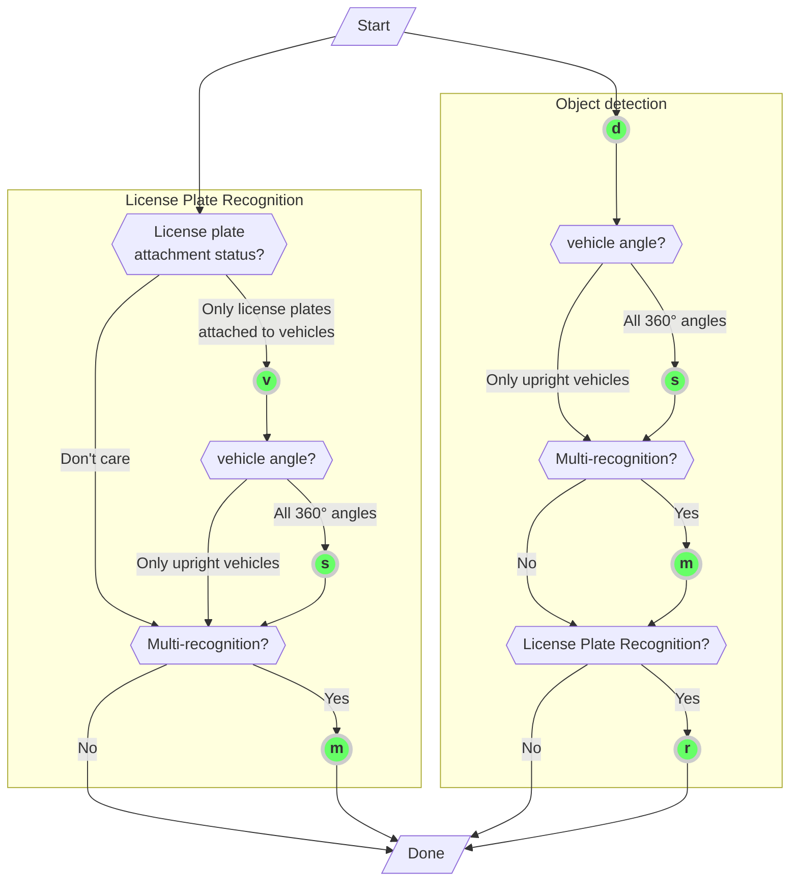

English | [한국어](doc.i18n/ko-KR/DevGuide.md) | [日本語](doc.i18n/ja-JP/DevGuide.md) | [Tiếng Việt](doc.i18n/vi-VN/DevGuide.md)

# Application Development Guide

## Table of Contents

- [1. Entry Points](#1-entry-points)
  - [1.1. anpr_initialize](#11-anpr_initialize)
  - [1.2. anpr_read_file](#12-anpr_read_file)
  - [1.3. anpr_read_pixels](#13-anpr_read_pixels)
- [2. Options](#2-options)
  - [2.1. Supported Options by License Type](#21-supported-options-by-license-type)
  - [2.2. Option Selection Guide](#22-option-selection-guide)
  - [2.3. Setting Region of Interest (RoI) / Region of Uninterest (RoU)](#23-setting-region-of-interest-roi--region-of-uninterest-rou)
  - [2.4. Setting Minimum License Plate Size](#24-setting-minimum-license-plate-size)
- [3. Output Data Formats](#3-output-data-formats)
  - [3.1. Vehicle License Plate Recognition Results](#31-vehicle-license-plate-recognition-results)
    - [3.1.1. text](#311-text)
    - [3.1.2. csv](#312-csv)
    - [3.1.3. json](#313-json)
    - [3.1.4. yaml](#314-yaml)
    - [3.1.5. xml](#315-xml)
  - [3.2. Object Detection Results](#32-object-detection-results)
    - [3.2.1. csv, text](#321-csv-text)
    - [3.2.2. json](#322-json)
    - [3.2.3. yaml](#323-yaml)
    - [3.2.4. xml](#324-xml)
- [4. Error Code Table](#4-error-code-table)

## 1. Entry Points

The prototype for all functions is as follows:

```cpp
#ifdef WIN32
#define TS_ANPR_ENTRY extern "C" __declspec(dllexport) const char* WINAPI
#else
#define TS_ANPR_ENTRY extern "C" const char*
#endif
```

_To avoid being verbose, the following will be denoted as `TS_ANPR_ENTRY`._

### 1.1. anpr_initialize

Initializes the library.
This function must be called once before using any other functions in the library.

```cpp
TS_ANPR_ENTRY anpr_initialize(const char* mode); // [IN] Sets the library operation mode
```

**Parameters**:

- `mode`
  - Used to specify the library's operation mode (the purpose has been expanded from the previous `outputFormat`)
  - Multiple settings can be specified, separated by a semicolon (`;`) (e.g., `json;sync`)
    ```python
      # Python Example
      # Multiple settings
      err = anpr_initialize(b'json;sync')
    ```
- Available options:
  - `outputFormat`:
    - Specifies the output data format
    - Supported formats: `text`, `json`, `yaml`, `xml`, `csv` _(default: `text`)_
    - You can simply use `text` or `json` without specifying `outputFormat`
  - `sync`:
    - Runs in synchronous mode (processes requests in the order they are called with thread locking)
    - If your application creates threads dynamically (not using a fixed-size thread pool) and you encounter the following error codes, consider using this option:
      - `103: Too many workers` – The number of library call threads exceeds the limit (maximum 256)
      - `104: Resource exhausted` – No more resources can be allocated
    - This mode eliminates the need for complex asynchronous thread management, but since it uses thread locks, parallel processing performance may be reduced
    - Can be specified as `sync=true` or `sync=false`, or simply as `sync` (if not specified, the default is `sync=false`)
      ```python
        # Python Example
        # Runs in synchronous mode
        err = anpr_initialize(b'sync')
      ```
  - `minChar`:
    - Specifies the minimum number of characters required for successful license plate recognition
    - If `minChar` is not specified, is `0`, negative, or not a number, the default value `4` is applied
      - Correct example: `minChar=5` (recognition succeeds only if at least 5 characters are detected)
        ```python
          # Python Example
          # Set number recognition to succeed only if there are 5 or more characters
          err = anpr_initialize(b'minChar=5')
        ```
      - Incorrect examples: `minChar=0`, `minChar=-10`, `minChar=Two` (the specified value is ignored and the default `4` is used)
  - `country`:
    - Specifies the country for the license plate recognition model.
      - Example: `country=JP` (set for Japanese license plates)
    - Available country codes:
      - `KR`: Korean license plates
      - `JP`: Japanese license plates
      - `VN`: Vietnamese license plates
        ```python
        # Python example
        # How to specify country
        err = anpr_initialize(b'country=KR')  # Korean license plates (default)
        err = anpr_initialize(b'country=JP')  # Japanese license plates
        err = anpr_initialize(b'country=VN')  # Vietnamese license plates
        ```
    - For the free trial, you can specify the country code in the application, but for the commercial license, the supported country is determined by the purchased license.
  - `symbol`: _(For Japanese license plates only)_
    - Specifies how to output the `·` and `-` characters included in Japanese license plates
      - `none`: Do not output either `·` or `-` (default value)
      - `zero`: Output `·` as `0`, do not output `-`
      - `dot`: Output `·` as is, do not output `-`
      - `full`: Output both `·` and `-` as is
        ```python
          # Python Example
          # Output both · and - as is
          err = anpr_initialize(b'symbol=full')
        ```

**Return value**:

- If successful, returns an empty `NULL-terminated string (0x00)`.
- If an error occurs, returns an error message as a string in the data format specified by the `outputFormat` in `mode` (UTF-8 encoded).

### 1.2. anpr_read_file

Recognizes vehicle license plates from an image file.

```cpp
TS_ANPR_ENTRY anpr_read_file(
  const char* imgFileName,  // [IN] Input image file name
  const char* outputFormat, // [IN] Output data format
  const char* options);     // [IN] Feature options
```

**Parameters**:

- `imgFileName`:
  - Input image file name (UTF-8 encoded)
  - Supported image file formats: `bmp`, `jpg`, `png`, `pnm`, `pbm`, `pgm`, `ppm`, `jfif`, `webp`
- `outputFormat`:
  - Output data format
  - Supported formats: `text`, `json`, `yaml`, `xml`, `csv` _(default: `text`)_
  - When using object detection options, `text` output will be provided in `csv` format.
- `options`:
  - Specifies options for the license plate recognition algorithm. (See: [2. Options](#2-options))

**Return value**:

- Returns the recognition result as a string in the data format specified by `outputFormat` (UTF-8 encoded).
- Depending on the `options` used (license plate recognition or object detection), the `outputFormat` may differ. (See: [3. Output Format](#3-output-format))

  ```python
    # Python Example
    result = anpr_read_file(b'input-image.jpg', b'json', b'vms')
    if len(result) > 0:
        print(result.decode('utf8'))
  ```

**Remarks**:

- The string buffer used for the `return value` is managed internally by the library; the application only needs to reference the string buffer.
- This string buffer is thread-safe, and the result is maintained for each thread until the next call.
- Reference sites:
  - https://docs.microsoft.com/ko-kr/windows/win32/medfound/image-stride
  - https://docs.microsoft.com/ko-kr/windows/win32/medfound/video-fourccs

### 1.3. anpr_read_pixels

Recognizes vehicle license plates from the memory buffer of a loaded image.
Since `TS-ANPR v2.3.0`, encoded image buffers are supported.

```cpp
TS_ANPR_ENTRY anpr_read_pixels(
  const unsigned char* pixels,  // [IN] Starting address of the image pixels
  const unsigned long width,    // [IN] Number of pixels in image width
  const unsigned long height,   // [IN] Number of pixels in image height
  const long stride,            // [IN] Number of bytes per image line
  const char* pixelFormat,      // [IN] Image pixel format
  const char* outputFormat,     // [IN] Output data format
  const char* options);         // [IN] Feature options
```

**Parameters**:

- `pixels`:
  - Starting address of the image pixels
- `width`:
  - Number of pixels in the image width
  - For encoded images, this is the total number of bytes
- `height`:
  - Number of pixels in the image height
  - Not used for encoded images (set to default value `0`)
- `stride`:
  - Number of bytes per image line (if `0`, it is assumed there is no padding and calculated automatically)
  - Not used for encoded images (set to default value `0`)
- `pixelFormat`:
  - Image pixel format
  - Supported pixel formats:
    - `GRAY`: Grayscale image (8bpp)
    - `BGRA`: BGRA (32bpp)
    - `RGBA`: RGBA (32bpp)
    - `RGB`: RGB (24bpp)
    - `BGR`: BGR (24bpp)
    - `BGR555`: BGR (16bpp)
    - `BGR565`: BGR (16bpp)
    - `HSV`: HSV (32bpp)
    - `YCrCb`: YUV444 (32bpp)
    - `I420`: YUV420 (12bpp)
    - `YV12`: YUV420 (12bpp)
    - `IYUV`: YUV420 (12bpp)
    - `NV12`: YUV420 (12bpp)
    - `NV21`: YUV420 (12bpp)
  - Supported image encoding formats:
    - `bmp`, `jpg`, `jpeg`, `png`, `pnm`, `pbm`, `pgm`, `ppm`, `jfif`, `webp`
    - If set to `encoded`, the image format is automatically detected
- `outputFormat`: _(Same as `anpr_read_file`)_
- `options`: _(Same as `anpr_read_file`)_

**Return value**: _(Same as `anpr_read_file`)_
**Remarks**: _(Same as `anpr_read_file`)_

```python
  # Python Examples

  # Input a video frame
  ret, frame = capture.read()
  height = frame.shape[0]
  width = frame.shape[1]
  result = anpr_read_pixels(bytes(frame), width, height, 0, b'BGR', b'json', b'vms')
  if len(result) > 0:
      print(result.decode('utf8'))

  # Input an image from the website
  response = requests.get('https://example.com/image.jpg')
  if response.status_code == 200:
      result = anpr_read_pixels(response.content, 0, 0, 0, b'encoded', b'json', b'vms')
      if len(result) > 0:
          print(result.decode('utf8'))
```

## 2. Options

- Various options can be specified to customize the license plate recognition algorithm for your environment.

### 2.1. Supported Options by License Type

| Character | Description                                                                                     | Applicable License                  |
| --------- | ----------------------------------------------------------------------------------------------- | ----------------------------------- |
| `v`       | Determines whether a license plate is attached to a car                                         | All                                 |
| `b`       | Determines whether a license plate is attached to a motorcycle (Vietnamese license plates only) | All                                 |
| `m`       | Recognizes all license plates in multiple vehicles                                              | `Object Detection`, `Pro`, `Server` |
| `s`       | Recognizes license plates from vehicles at any 360° angle (surround recognition)                | `Object Detection`, `Pro`, `Server` |
| `d`       | Object detection (for load/unload status)                                                       | All                                 |
| `r`       | Recognizes license plates of detected vehicles                                                  | All                                 |
| `i`       | Sets Region of Interest (RoI)                                                                   | All                                 |
| `x`       | Sets Region of Uninterest (RoU)                                                                 | All                                 |
| `a`       | Sets minimum license plate size                                                                 | All                                 |

- Depending on the license type, features and the number of vehicles that can be recognized simultaneously may vary. (See: [TS-ANPR Engine](LICENSE.md#2-ts-anpr-engine))

### 2.2. Option Selection Guide

In the flowchart below, follow the conditions from `Start` to `Done` and collect the characters in the green circles you pass through. Use these collected characters as the option value (the order of the characters does not matter).
For example, if your path is `Start` → `v` → `s` → `m` → `Done`, the option value would be `"vsm"`.



- Examples of License Plate Recognition Options  
   | Options | Description
  |---------|------------------------------------------------------------
  | | Recognizes one license plate among all plates
  | `v` | Recognizes one license plate attached to a vehicle
  | `b` | Recognizes one license plate attached to a motorcycle (Vietnamese license plates only)
  | `m` | Recognizes all license plates (multi-recognition)
  | `vm` | Recognizes all license plates attached to vehicles (multi-recognition)
  | `vs` | Recognizes one license plate attached to a vehicle, 360° surround recognition
  | `vsm` | Recognizes all license plates attached to vehicles, 360° surround recognition (multi-recognition)

- Examples of Object Detection Options
  | Options | Description
  |---------|------------------------------------------------------------
  | `d` | Single object detection (does not recognize vehicle license plates)
  | `dr` | Single object detection with vehicle license plate recognition
  | `ds` | Single object detection, 360° surround detection (does not recognize vehicle license plates)
  | `dsr` | Single object detection, 360° surround detection with vehicle license plate recognition
  | `dm` | Multi-object detection (does not recognize vehicle license plates)
  | `dmr` | Multi-object detection with vehicle license plate recognition (does not recognize other objects)
  | `dms` | Multi-object detection, 360° surround detection (does not recognize vehicle license plates)
  | `dmsr` | Multi-object detection, 360° surround detection with vehicle license plate recognition

### 2.3. Setting Region of Interest (RoI) / Region of Uninterest (RoU)


#### Region of Interest (RoI)

- The region of interest is defined as a polygon by connecting the pixel coordinates of each vertex.
  - After the character `i`, list the pixel coordinates of each vertex in the order of x, y, separated by commas.
- Multiple regions of interest can be set, and they can be combined with other license plate recognition options.

#### Region of Uninterest (RoU)

- The region of uninterest is defined as a polygon by connecting the pixel coordinates of each vertex.
  - After the character `x`, list the pixel coordinates of each vertex in the order of x, y, separated by commas.
- Multiple regions of uninterest can be set, and they can be combined with other license plate recognition options.

**Note**: If neither a region of interest nor a region of uninterest is specified, license plate recognition will be performed on the entire image.
If both a region of interest and a region of uninterest are specified and there are overlapping areas, the region of uninterest takes precedence. Therefore, any license plates in the overlapping area will be ignored.

```python
# Python Example
# Given the following vertex pixel coordinates for each polygonal region in the image above:
# RoI = [(810,64), (939,1182), (1486,1182), (1149,571), (879,124), (839,64)]
# RoI2 = [(771,67), (479,1182), (1793,1182), (801,67)]
# RoU = [(851,70), (923,134), (1753,1182), (1789,1182), (1789,250), (1176,87), (946,68)]

# Setting a single region of interest (RoI)
result = anpr_read_file(
  b'roi.jpg',    # Input file name
  b'text',       # Output format
  b'vi810,64,939,1182,1486,1182,1149,571,879,124,839,64') # Use the 'v' option to recognize only license plates attached to vehicles

# Setting two regions of interest (RoI)
result = anpr_read_file(
  b'roi.jpg',    # Input file name
  b'text',       # Output format
  b'vi810,64,939,1182,1486,1182,1149,571,879,124,839,64i771,67,479,1182,1793,1182,801,67')

# Setting one region of interest and one region of uninterest (RoU)
result = anpr_read_file(
  b'roi.jpg',    # Input file name
  b'text',       # Output format
  b'vi810,64,939,1182,1486,1182,1149,571,879,124,839,64x851,70,923,134,1753,1182,1789,1182,1789,250,1176,87,946,68')

# Setting a single region of uninterest (RoU)
result = anpr_read_file(
  b'roi.jpg',    # Input file name
  b'text',       # Output format
  b'vx851,70,923,134,1753,1182,1789,1182,1789,250,1176,87,946,68')
```

### 2.4. Setting Minimum License Plate Size

- The minimum license plate size is specified after the character `a` as the area of the license plate bounding box (width x height in pixels). For example, if the width is `100` pixels and the height is `40` pixels, enter `a4000`.
- If a minimum license plate size is set, any license plate smaller than this will be ignored.

  ```python
  # Python Example
  # In the image, the license plate size is 156 x 154 = 24,024
  result = anpr_read_file(
    b'test.jpg',   # Input file name
    b'text',       # Output format
    b'vi7,580, 829,293, 1910,325, 1798,1077, 0,1077a24024'  # Specify RoI and minimum license plate size
  )
  ```

## 3. Output Data Formats

The output data is divided into two formats: object detection (when d is included in the options) and vehicle license plate recognition (when d is not included).

### 3.1. Vehicle License Plate Recognition Results

### 3.1.1. `text`

Only the vehicle license plate text is output.
If there are multiple license plates, they are separated by the line break character CR (0x0d).

```text
01가2345
67나8901
```

If no license plate is recognized, an empty text (`NULL terminated string (0x00)`) is output.

If an error is returned, it is output in the following text format:

```text
error: (1) Invalid parameters
```

##### 3.1.2. `csv`

Outputs the vehicle license plate and its attributes in `csv` format.
Each recognized license plate is represented by one line, and each column is separated by a comma (`,`).

```csv
01가2345,1217,2083,92,175,12.45,0.75,0.83,0.20,ev
67나8901,1108,1317,67,217,12.45,0.76,0.89,0.10,
```

The meaning of each column is as follows:
| Column | Description | Notes
|-----:|---------------------------|------------------------
| 1 | Vehicle license plate number | `text`
| 2 | Top-left x coordinate of license plate | `area.x`
| 3 | Top-left y coordinate of license plate | `area.y`
| 4 | License plate width | `area.width`
| 5 | License plate height | `area.height`
| 6 | License plate angle | `area.angle`
| 7 | OCR confidence | `conf.ocr`
| 8 | Plate recognition confidence | `conf.plate`
| 9 | OCR elapsed time (seconds) | `elapsed`
| 10<sup>(1)</sup> | Eco-friendly electric vehicle status | `attr.ev`

- <sup>(1)</sup> (For Korean license plates only) If the vehicle is an eco-friendly electric vehicle, `ev` is output; otherwise, the field is left blank.

If no license plate is recognized, an empty text (`NULL terminated string (0x00)`) is output.

If an error is returned, it is output in the following text format:

```csv
error,1,Invalid parameters
```

### 3.1.3. `json`

Outputs the vehicle license plate and its attributes in `json` format.

```jsx
[
  {
    // First license plate
    text: "01가2345", // Vehicle license plate number
    area: {
      // License plate area (in pixels)
      x: 1217, // Top-left x coordinate
      y: 2083, // Top-left y coordinate
      width: 92, // Width
      height: 175, // Height
      angle: 12.45, // Tilt angle (degrees)
    },
    attrs: {
      // License plate attributes
      ev: true, // Eco-friendly electric vehicle status
    },
    ev: true, // deprecated (moved to attrs.ev, will be removed in future versions)
    conf: {
      // Confidence (range: 0 ~ 1)
      ocr: 0.75, // OCR confidence
      plate: 0.84, // Plate recognition confidence
    },
    elapsed: 0.27, // Elapsed time (in seconds)
  },
  {
    // Second license plate
    text: "67나8901",
    area: {
      x: 1108,
      y: 1317,
      width: 67,
      height: 217,
      angle: 12.45,
    },
    attrs: {
      ev: false,
    },
    ev: false,
    conf: {
      ocr: 0.76,
      plate: 0.89,
    },
    elapsed: 0.14,
  },
];
```

If no license plate is recognized, empty data is output as follows:

```jsx
[];
```

If an error is returned, it is output in the following `json` format:

```jsx
{
  "error": {
    "code": 1,
    "message": "Invalid parameters"
  }
}
```

### 3.1.4. `yaml`

Outputs the vehicle license plate and its attributes in `yaml` format.

```yaml
- text: 01가2345 # First license plate, vehicle number
  area: # License plate area (in pixels)
    x: 1217 # Top-left x coordinate
    y: 2083 # Top-left y coordinate
    width: 92 # Width
    height: 175 # Height
    angle: 12.45 # Tilt angle (degrees)
  conf: # Confidence (range: 0 ~ 1)
    ocr: 0.75 # OCR confidence
    plate: 0.83 # Plate recognition confidence
  attrs: # License plate attributes
    ev: true # Eco-friendly electric vehicle status
  ev: true # deprecated (moved to attrs.ev, will be removed in future versions)
  elapsed: 0.20 # Elapsed time (seconds)
- text: 67나8901 # Second license plate
  area:
    x: 1108
    y: 1317
    width: 67
    height: 217
    angle: 12.45
  conf:
    ocr: 0.76
    plate: 0.89
  ev: false
  elapsed: 0.10
```

If no license plate is recognized, empty data is output as follows:

```yaml

```

If an error is returned, it is output in the following `yaml` format:

```yaml
error
  code: 1
  message: Invalid parameters
```

### 3.1.5. `xml`

Outputs the vehicle license plate and its attributes in `xml` format.

```xml
<?xml version="1.0" encoding="utf-8"?>
<data>
  <!-- First license plate
    text: vehicle license plate number
    ev: deprecated (moved to attrs.ev, will be removed in future versions)
    elapsed: elapsed time (seconds)
  -->
  <license-plate text="01가2345" ev="true" elapsed="0.20">
    <!-- License plate attributes
      ev: eco-friendly electric vehicle status
    -->
    <attrs ev="true"/>
    <!-- License plate area (in pixels)
      x: top-left x coordinate
      y: top-left y coordinate
      width: width
      height: height
      angle: tilt angle (degrees)
    -->
    <area x="1217" y="2083" width="92" height="175" angle="12.45"/>
    <!-- Confidence (range: 0 ~ 1)
      ocr: OCR confidence
      plate: plate recognition confidence
    -->
    <conf ocr="0.75" plate="0.83"/>
  </license-plate>
  <!-- Second license plate -->
  <license-plate text="67나8901" ev="false" elapsed="0.11">
    <attrs ev="false"/>
    <area x="1108" y="1317" width="67" height="217"/>
    <conf ocr="0.76" plate="0.89"/>
  </license-plate>
</data>
```

If no license plate is recognized, empty data is output as follows:

```xml
<?xml version="1.0" encoding="utf-8"?>
<data />
```

If an error is returned, it is output in the following `xml` format:

```xml
<?xml version="1.0" encoding="utf-8"?>
<error code="1" message="Invalid parameters" />
```

#### 3.2. Object Detection Results

Detects pre-trained objects in the image.
A distinguishing feature is that it can recognize distorted objects in original images taken with a 360° fisheye lens camera.
Currently supported object classes are as follows:
| class | Name  
|--------------|----------------------------------
| `car` | Car
| `motorcycle` | Motorcycle

##### 3.2.1. `csv`, `text`

Outputs object detection results in `csv` format text.
If the output format is specified as `text`, it is also output in `csv` format.

Each detected object is represented by one line, and each column is separated by a comma (`,`).

```csv
car,2171,2281,396,521,0.9679,0.2886,51조8969,2420,2295,110,81,147.5933,0.9005,0.7864,0.3913,ev
car,264,2266,433,543,0.9706,0.2886,41노7656,315,2281,103,81,211.3135,0.9160,0.8299,0.4189,
car,777,0,579,403,0.9716,0.2886 // When there is no license plate information
```

The meaning of each column is as follows:
| Column | Description | Notes
|-----:|-----------------------------------|------------------------
| 1 | Class | `class`
| 2 | x pixel coordinate | `area.x`
| 3 | y pixel coordinate | `area.y`
| 4 | Width | `area.width`
| 5 | Height | `area.height`
| 6 | Confidence | `conf`
| 7 | Elapsed time (seconds) | `elapsed`
| 8<sup>(1)</sup> | License plate number | `licensePlate.text`
| 9 | Top-left x coordinate of license plate | `licensePlate.area.x`
| 10 | Top-left y coordinate of license plate | `licensePlate.area.y`
| 11 | License plate width | `licensePlate.area.width`
| 12 | License plate height | `licensePlate.area.height`
| 13 | License plate angle | `licensePlate.area.angle`
| 14 | OCR confidence | `licensePlate.conf.ocr`
| 15 | Plate recognition confidence | `licensePlate.conf.plate`
| 16 | OCR elapsed time (seconds) | `licensePlate.elapsed`
| 17<sup>(2)</sup> | Eco-friendly electric vehicle status | `licensePlate.attrs.ev`

- <sup>(1)</sup> Columns from 8 onward are output only if the `r` option is used and a license plate is recognized; otherwise, all subsequent columns are omitted.
- <sup>(2)</sup> (For Korean license plates only) Column 17 is output as ev if the vehicle is recognized as an eco-friendly electric vehicle; otherwise, it is left blank.

If no object is detected, an empty text (`NULL terminated string (0x00)`) is output.

If an error is returned, it is output in the following `text` format:

```csv
error,1,Invalid parameters
```

##### 3.2.2. `json`

Outputs object detection results in `json` format.

```jsx
 [
  {                           // First object
    "class": "car",           // Object class
    "area": {                 // Object area (in pixels)
      "x": 2171,              // Top-left x coordinate
      "y": 2281,              // Top-left y coordinate
      "width": 396,           // Width
      "height": 521           // Height
    },
    "conf": 0.9679,           // Object detection confidence (range: 0 ~ 1)
    "elapsed": 0.2513,        // Elapsed time (seconds)
    "licensePlate": [         // License plate(s)
      {
        "text": "51조8969"    // License plate number
        "area": {             // License plate area (in pixels)
          "x": 2420,          // Top-left x coordinate
          "y": 2295           // Top-left y coordinate
          "width": 110,       // Width
          "height": 81,       // Height
          "angle": 147.5933   // Tilt angle (degrees)
        },
        "attrs": {            // License plate attributes
          "ev": true          // Eco-friendly electric vehicle status
        },
        "conf": {             // Confidence (range: 0 ~ 1)
          "ocr": 0.9005,      // OCR confidence
          "plate": 0.7864     // Plate recognition confidence
        },
        "elapsed": 0.3525,    // Elapsed time (seconds)
      }
    ]
  },
  {                           // Second object
    "class": "car",
    "area": {
      "x": 264,
      "y": 2266,
      "width": 433,
      "height": 543
    },
    "conf": 0.9706,
    "elapsed": 0.2513,
    "licensePlate": [
      {
        "text": "41노7656"
        "area": {
          "x": 315,
          "y": 2281,
          "width": 103,
          "height": 81,
          "angle": 211.3135
        },
        "attrs": {
          "ev": false
        },
        "conf": {
          "ocr": 0.916,
          "plate": 0.8299
        },
        "elapsed": 0.4402
      }
    ]
  },
  {                           // Third object (when there is no license plate information)
    "class": "car",
    "area": {
      "x": 777,
      "y": 0
      "height": 403,
      "width": 579,
    },
    "conf": 0.9716,
    "elapsed": 0.2513
  }
]
```

If no object is detected, empty data is output as follows:

```jsx
[];
```

If an error is returned, it is output in the following `json` format:

```jsx
{
  "error": {
    "code": 1,
    "message": "Invalid parameters"
  }
}
```

##### 3.2.3. `yaml`

Outputs object detection results in `yaml` format.

```yaml
- class: car # First object, object class
  area: # Object area (in pixels)
    x: 2171 # Top-left x coordinate
    y: 2281 # Top-left y coordinate
    width: 396 # Width
    height: 521 # Height
  conf: 0.9678 # Object detection confidence (range: 0 ~ 1)
  elapsed: 0.3190 # Elapsed time (seconds)
  licensePlate: # License plate(s)
    - text: 51조8969 # License plate number
      area: # License plate area (in pixels)
        x: 2420 # Top-left x coordinate
        y: 2295 # Top-left y coordinate
        width: 110 # Width
        height: 81 # Height
        angle: 147.5933 # Tilt angle (degrees)
      attrs: # License plate attributes
        ev: true # Eco-friendly electric vehicle status
      conf: # Confidence (range: 0 ~ 1)
        ocr: 0.9005 # OCR confidence
        plate: 0.7864 # Plate recognition confidence
      elapsed: 0.3226 # Elapsed time (seconds)
- class: car # Second object
  area:
    x: 264
    y: 2266
    width: 433
    height: 543
  conf: 0.9706
  elapsed: 0.3191
  licensePlate:
    - text: 41노7656
      area:
        x: 315
        y: 2281
        width: 103
        height: 81
        angle: 211.3135
      conf:
        ocr: 0.916
        plate: 0.8299
      attrs:
        ev: false
      elapsed: 0.5527
- class: car # Third object (when there is no license plate information)
  area:
    x: 777
    y: 0
    width: 579
    height: 403
  conf: 0.9716
  elapsed: 0.3191
```

If no object is detected, empty data is output as follows:

```yaml

```

If an error is returned, it is output in the following yaml format:

```yaml
error
  code: 1
  message: Invalid parameters
```

##### 3.2.4. `xml`

객체 인식 결과를 `xml` 형식으로 출력합니다.

```xml
<?xml version="1.0" encoding="utf-8"?>
<data>
  <!-- First object
    class: object class
    conf: object detection confidence (range: 0 ~ 1)
    elapsed: elapsed time (seconds)
  -->
  <object class="car" conf="0.9679" elapsed="0.3287">
    <!-- Object area (in pixels)
      x: top-left x coordinate
      y: top-left y coordinate
      width: width
      height: height
    -->
    <area x="2171" y="2281" width="396" height="521"/>

    <!-- License plate
      text: license plate number
      elapsed: elapsed time (seconds)
    -->
    <license-plate text="51조8969" elapsed="0.3961">

      <!-- License plate attributes
        ev: eco-friendly electric vehicle status
      -->
      <attrs ev="true"/>

      <!-- License plate area (in pixels)
        x: top-left x coordinate
        y: top-left y coordinate
        width: width
        height: height
        angle: tilt angle (degrees)
      -->
      <area x="2420" y="2295" width="110" height="81" angle="147.5933"/>

      <!-- Confidence (range: 0 ~ 1)
        ocr: OCR confidence
        plate: plate recognition confidence
      -->
      <conf ocr="0.9005" plate="0.7864"/>
    </license-plate>
  </object>

  <!-- Second object -->
  <object class="car" conf="0.9706" elapsed="0.3287">
    <area x="264" y="2266" width="433" height="543"/>
    <license-plate text="41노7656" elapsed="0.4364">
      <attrs ev="false"/>
      <area x="315" y="2281" width="103" height="81" angle="211.3135"/>
      <conf ocr="0.9160" plate="0.8299"/>
    </license-plate>
  </object>

  <!-- Third object (when there is no license plate information) -->
  <object class="car" conf="0.9716" elapsed="0.3287">
    <area x="777" y="0" width="579" height="403"/>
  </object>
</data>
```

If no object is detected, empty data is output as follows:

```xml
<?xml version="1.0" encoding="utf-8"?>
<data />
```

If an error is returned, it is output in the following xml format:

```xml
<?xml version="1.0" encoding="utf-8"?>
<error code="1" message="Invalid parameters" />
```

## 4. Error Code Table

The complete list of error codes is as follows:

|  code | message                    | Description                                                                                    |
| ----: | -------------------------- | ---------------------------------------------------------------------------------------------- |
|   `1` | `Invalid parameters`       | When function call arguments are invalid                                                       |
|   `2` | `File not found`           | When the input image file does not exist                                                       |
|   `3` | `Invalid image`            | When the input image memory does not match the required format                                 |
|   `4` | `Unsupported image format` | When the input image is in an unsupported format                                               |
| `100` | `License expired`          | When the license has expired                                                                   |
| `101` | `Corrupted library`        | When some library configuration files are missing or corrupted                                 |
| `102` | `Not initialized`          | When the engine has not been initialized                                                       |
| `103` | `Too many workers`         | When the number of library call threads exceeds the limit (maximum 256)                        |
| `104` | `Resource exhausted`       | When no more resources can be allocated                                                        |
| `105` | `License not installed`    | When the license is not installed (occurs if the free trial license is not installed on Linux) |
| `106` | `USB dongle I/O error`     | When reading the USB license dongle fails                                                      |
| `107` | `License required`         | When a license is required to use the function                                                 |
| `108` | `Unsupported platform`     | When running in an unsupported environment                                                     |
| `200` | `Unknown`                  | Other undefined errors                                                                         |
