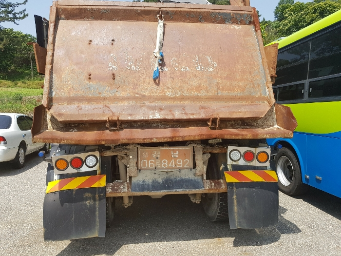
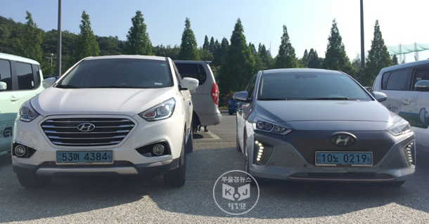
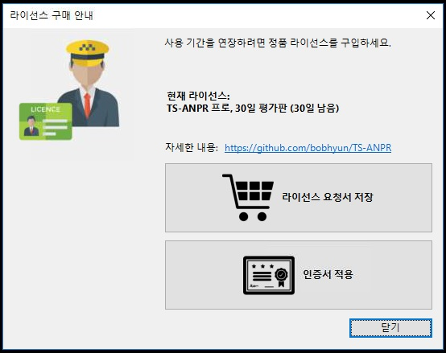

TS-ANPR
===

TS-ANPR은 딥러닝 기반의 대한민국 차량 번호 인식 엔진입니다.
#### 차번 인식 데모: [http://tsnvr.ipdisk.co.kr/](http://tsnvr.ipdisk.co.kr/) 


#### 최신 엔진 다운로드: [https://github.com/bobhyun/TS-ANPR/releases/](https://github.com/bobhyun/TS-ANPR/releases/)


#### 응용 프로그램 개발 가이드: [https://github.com/bobhyun/TS-ANPR/blob/main/DevGuide.md](https://github.com/bobhyun/TS-ANPR/blob/main/DevGuide.md) 


- [DLL entry points](https://github.com/bobhyun/TS-ANPR/blob/main/DevGuide.md#1-dll-entry-points)
- [입력 이미지 파일 형식 (`bmp`, `jpg`, `png`, `pnm`, `pbm`, `pgm`, `ppm`, `jfif`, `webp`)](https://github.com/bobhyun/TS-ANPR/blob/main/DevGuide.md#12-anpr_read_file)
- [입력 이미지 픽셀 형식 (`GRAY`, `BGRA`, `RGBA`, `RGB`, `BGR`, `BGR555`, `BGR565`, `HSV`, `YCrCb`, `I420`, `YV12`, `IYUV`, `NV12`, `NV21`)](https://github.com/bobhyun/TS-ANPR/blob/main/DevGuide.md#13-anpr_read_pixels)
- [결과 출력 형식 (`text`, `json`, `yaml`, `xml`)](https://github.com/bobhyun/TS-ANPR/blob/main/DevGuide.md#2-output-format)
- [프로그래밍 언어별 예제 소스 코드 (`C/C++`, `C#`, `Visual Basic`, `Python`, `JavaScript/Node.js`, `Go`, `Pascal/Delphi`, `Perl`, `Ruby`)](https://github.com/bobhyun/TS-ANPR/blob/main/DevGuide.md#4-%EC%98%88%EC%A0%9C)
- [pdf 문서 다운로드](https://github.com/bobhyun/TS-ANPR/raw/main/TS-ANPR-Manual.pdf)


## 최신 버전 정보
#### **`[2023-1-18]` v1.1.0 출시**

- 덤프 트럭, 중장비 번호판 인식률 개선
  
  <br/>  `[이미지 출처: 헤럴드경제]`
  
  <br/>  `[이미지 출처: 부동산미래]`
  
  <br/>  `[이미지 출처: jumbocar.tistory.com]`
- 친환경 전기 자동차 인식 기능 추가
  - Output Format에 `ev` 항목 추가됨 [(개발 가이드 참고)](https://github.com/bobhyun/TS-ANPR/blob/main/DevGuide.md#2-output-format)
    
    <br/>  `[이미지 출처: 부울경뉴스]`


## 특징

### 1. 차량 장착 검사 (Vehicle Mounted)
차체가 보이는 이미지에서 차량에 장착된 번호판인지 구분합니다.
**차량 장착(v)** 옵션을 사용하면 차량에 장착된 번호판만 인식합니다.
<br/>

아래 이미지처럼 차량없이 번호판만 있거나 바이크 번호판 등은 무시합니다.
<br/>
<br/>`[이미지 출처: 연합뉴스]`
<br/>
<br/>`[이미지 출처: 바이커즈랩]`

번호판만 근접 촬영된 경우는 차량 인식이 안되는 경우가 있는데, 이런 경우 **차량 장착(v)** 옵션을 사용하지 않으면 차량 번호를 인식할 수 있습니다.
<br/>


### 2. 다중 인식 (Multiple Recognition)
**다중 인식(m)** 옵션을 사용하면 이미지에 차량이 여러 대 있으면 모두 인식합니다.
<br/>

**다중 인식(m)** 옵션을 사용하지 않으면 여러 대 차량 중 가장 번호판 신뢰도가 높은(잘 보이는) 것 하나만 인식합니다.
<br/>


### 3. 서라운드 인식 (Surround Recognition)
**서라운드 인식(s)** 옵션을 사용하면 전복된 차량 또는 어안 렌즈 카메라로 촬영한 차량 등 이미지 내의 차량이 사방으로 기울어져 있거나 넘어져 있는 경우도 차량 번호를 인식할 수 있습니다.
<br/>
<br/>`[이미지 출처: KBS]`
<br/>


## 사용법

엔진 파일을 다운로드한 후 압축을 풀면 아래와 같이 디렉토리가 구성되어 있습니다. 
```
  /x64                    # 64bit (amd64) 바이너리 디렉토리  
    tsanpr.dll            # 공유 라이브러리 (API 제공)
    lpvr-xxxxx.eon        # 딥러닝 모델 #1
    lpocr_kr-xxxxx.eon    # 딥러닝 모델 #2
    tshelper.exe          # 도우미 앱 (라이선스 관리, Github 링크 제공)
  /x86                    # 32bit 바이너리 디렉토리
    tsanpr.dll            # 공유 라이브러리 (API 제공)
    lpvr-xxxxx.eon        # 딥러닝 모델 #1
    lpocr_kr-xxxxx.eon    # 딥러닝 모델 #2
    tshelper.exe          # 도우미 앱 (라이선스 관리, Github 링크 제공)
```

`tshelper.exe` 파일을 실행하면 해당 컴퓨터에 `30일 평가판 라이선스`가 자동으로 설치되며, 이 후 30일 동안 `TS-ANPR 프로`의 모든 기능을 사용해 볼 수 있습니다. 


- 응용 프로그램 개발 전 단계의 기본적인 성능 테스트는 [온라인 데모 사이트 http://tsnvr.ipdisk.co.kr/](http://tsnvr.ipdisk.co.kr/) 를 이용하실 수 있습니다.
- 응용 프로그램 개발 단계에서는 [응용 프로그램 개발 가이드](https://github.com/bobhyun/TS-ANPR/blob/main/DevGuide.md) 와 포함된 프로그래밍 언어별 예제들을 참고하시기 바랍니다.
- 개발 관련 질문이나 요청 사항들은 [Issues](https://github.com/bobhyun/TS-ANPR/issues)에 등록해 주시면 적극적으로 지원하겠습니다.


<br/>

- 개발 문의: bobhyun@gmail.com
- 구매 문의: skju3922@naver.com 
- 📞 전화: <a href="tel:02-6084-3922">02-6084-3922</a>
  
<br/>

