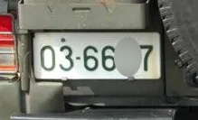
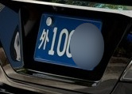
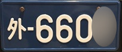
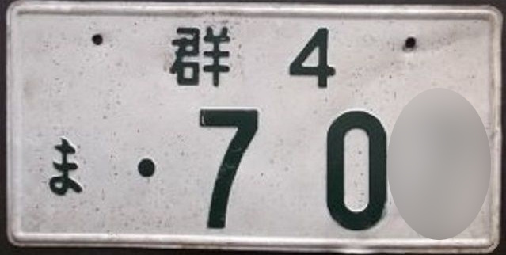
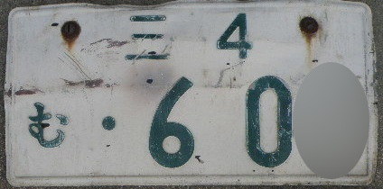

English | [한국어](doc.i18n/ko-KR/README.md) | [日本語](doc.i18n/ja-JP/README.md) | [Tiếng Việt](doc.i18n/vi-VN/README.md)

# 😍TS-ANPR

**TS-ANPR** is a deep learning-based vehicle license plate recognition engine that supports the license plate standards of Korea, Japan, and Vietnam.

#####  Application Example (TS-IVR)

https://github.com/user-attachments/assets/71a2977a-4d1f-479b-a909-21c03fd9f013

##### [😍 Live Demo](http://tsnvr.ipdisk.co.kr/) 👈 Check the number recognition performance directly here.

##### [🚀 Download the Latest Engine](https://github.com/bobhyun/TS-ANPR/releases/)

#####  Code Samples in Popular Languages

- [C](examples/C/) | [C#](examples/C#/) | [C++](examples/C++/) | [Clojure](examples/Clojure/) | [Dart](examples/Dart/) | [Delphi](examples/Delphi/) | [F#](examples/F#/) | [Go](examples/Go/) | [Haskell](examples/Haskell/) | [Java](examples/Java/) | [JavaScript](examples/JavaScript/) | [Julia](examples/Julia/) | [Kotlin](examples/Kotlin/) | [Lua](examples/Lua/) | [Perl](examples/Perl/) | [Python](examples/Python/) | [Ruby](examples/Ruby/) | [Rust](examples/Rust/) | [Scala](examples/Scala/) | [Swift](examples/Swift/) | [TypeScript](examples/TypeScript/) | [VB.NET](examples/VB.NET/)

#####  Application Development Guide

- [TS-ANPR](DevGuide.md)
- [TS-CAM](https://github.com/bobhyun/TS-CAM/blob/main/DevGuide.md)

##### [ How to install](Usage.md)

##### [ License](LICENSE.md)

_If you have any questions or requests, please feel free to open an [Issues](https://github.com/bobhyun/TS-ANPR/issues).
We are happy to assist and welcome your feedback!_

- Inquiry: 📧 skju3922@naver.com

---

## Table of Contents

- [Latest Version Information](#latest-version-information)
- [Deep Learning Model Types and Their Applications](#deep-learning-model-types-and-their-applications)
- [Comparison Table of Recognition Speed by Deep Learning Model](#comparison-table-of-recognition-speed-by-deep-learning-model)
- [Key Features](#key-features)
- [Various Recognition Options](#various-recognition-options)

 

---

## Latest Version Information

#### Release v3.0.0 (2025.5.27)🎉

1. Added Japanese and Vietnamese vehicle license plate recognition features.

   - Supports 140 regions in Japan, diplomatic, Self-Defense Forces, and old-style plates.

   - Supports Vietnamese vehicle and motorcycle plates.

   - Country support based on license:

     - Free trial license: Specify the country using the `country` setting in the application's initialization function. ([Details](DevGuide.md#11-anpr_initialize))
     - Commercial license: The `country` specified in the initialization function is ignored; the supported country is determined by the purchased license.

2. Added Region of Interest (RoI) / Region of Uninterest (RoU) Configuration
   - Users can now define specific areas for license plate recognition within input images. ([Details](DevGuide.md#23-setting-region-of-interest-roi--region-of-uninterest-rou))
     
3. Added Minimum License Plate Size Configuration

   - License plate regions smaller than the configured minimum size will be ignored. ([Details](DevGuide.md#24-setting-minimum-license-plate-size))

4. Improved Recognition Accuracy
   - Enhanced algorithm improves license plate recognition accuracy.
5. `tscam` Module Separated
   - `tscam` has been separated from `TS-ANPR` and is now distributed via [TS-CAM Releases](https://github.com/bobhyun/TS-CAM/releases).
   - Support for HTTPS cameras using self-signed certificates

## Deep Learning Model Types and Their Applications

Licenses apply to all deep learning models, so you just need to select the model that best fits your intended purpose.

| Model |     Recognition Speed      | Application Examples                                                                                                                                                                                                                                                                           |
| :---: | :------------------------: | :--------------------------------------------------------------------------------------------------------------------------------------------------------------------------------------------------------------------------------------------------------------------------------------------- |
| **S** | Fast (for short range) | Parking lot entry and exit management                                                                                                                                                                                                                   |
| **M** | Normal (for mid range) | Parking space occupancy management / Parking location search  Fisheye lens camera (360° surround recognition)  Overturned vehicle (360° surround recognition)  |
| **L** | Slow (for long range)  | Large outdoor parking lot / Vehicle counting  Multi-lane vehicle license plate recognition  Traffic volume counting                                               |

## Comparison Table of Recognition Speed by Deep Learning Model

| CPU                               | Cores | Threads | Clock(1) | OS                              | S(2) | M(2) | L(2) |
| --------------------------------- | ----: | ------: | ------------------: | :------------------------------ | --------------: | --------------: | --------------: |
| Intel i7-12700                    |    12 |      20 |                 2.1 | 64-bit Windows 64-bit Linux |           0.021 |           0.036 |           0.054 |
| Intel i5-6500                     |     4 |       4 |                 3.2 | 64-bit Windows 64-bit Linux |           0.031 |           0.078 |           0.140 |
| (Same)                            |       |         |                     | 32-bit Windows                  |           0.078 |           0.172 |           0.296 |
| Intel i3-8100                     |     4 |       4 |                 3.6 | 64-bit Windows 64-bit Linux |           0.042 |           0.087 |           0.156 |
| (Same)                            |       |         |                     | 32-bit Windows                  |           0.089 |           0.204 |           0.656 |
| Intel Celeron J4005               |     2 |       2 |                 2.0 | 64-bit Windows 64-bit Linux |           0.396 |           0.886 |           1.563 |
| (Same)                            |       |         |                     | 32-bit Windows                  |           0.629 |           1.355 |           2.368 |
| Intel Celeron 1037U(3) |     2 |       2 |                 1.8 | 32-bit Windows                  |           0.484 |           1.061 |           1.856 |
| Rockchip RK3588S(4)    |     8 |       8 |                 1.5 | 64-bit Linux                    |           0.227 |           0.462 |           0.842 |
| Broadcom BCM2711(5)    |     4 |       4 |                 1.8 | 64-bit Linux                    |           0.465 |           1.024 |           1.817 |

- Measured with an image containing only one vehicleMeasured with an image containing only one vehicle
- (1) Unit: GHz
- (2) Unit: Second
- (3) 32-bit only CPU [(View manufacturer specs)](https://www.intel.co.kr/content/www/kr/ko/products/sku/71995/intel-celeron-processor-1037u-2m-cache-1-80-ghz/specifications.html)
- (4) NanoPi R6S [(View manufacturer specs)](https://www.friendlyelec.com/index.php?route=product/product&product_id=289)
- (5) Raspberry Pi4 [(View manufacturer specs)](https://www.raspberrypi.com/products/raspberry-pi-4-model-b/)

## Key Features

#### 1. License plate recognition performance

Has excellent adaptability to various environmental factors below.

- Reflective film (Korean license plates)
  

    
    
    
    
    
    
    
    
    
    
    
    
    
    
  

- Night noise
  

    
    
    
    
    
    
    
    
    
  

- Shooting angle
  

    
    
    
    
    
    
    
    
    
    
    
    
  

- Weather / Lighting
  

    
    
    
    
    
    
    
    
    
    
  

- Contamination / Damage
  
    
    
    
    
    
    
    
    
    
    
    
  

- 360-degree fisheye camera image.
  - _Recognizes multiple vehicle license plates directly from the original image without dewarping._
  

    
  

#### 2. Supports various license plate formats

Supports various license plate formats as shown below.

- Korean license plates

  - Dump truck & heavy equipment license plates
    
    
      
      
      
      
      
      
    

  - Special license plates (temporary, diplomatic, military)
    

      
      
      
      
      
      
      
      
      
      
      
      
    

  - Eco-friendly electric vehicle license plate
    - The recognition result distinguishes whether it is an eco-friendly electric vehicle.
    - However, if the license plate format does not distinguish electric vehicles from internal combustion vehicles, such as commercial plates, identification is not possible.
    

      
      
    

  - 1980s and 1990s vintage license plates
    - Supports the characters ‘처’, ‘퍼’, ‘차’, ‘파’, ‘추’ to ‘후’, and ‘그’ to ‘흐’ used before the 1996 license plate revision.
    - Supports the old format of USFK license plates.
    
    
      
      
      
      
      
    

- Japanese license plates
  - Special license plates (diplomatic, Self-Defense Forces)
    
    
      
      
      
      
      
      
      
      
      
      
    

  - 1960s vintage license plates
    - Supports the old license plate format that used only a single kanji character (e.g., 東, 京, 名) for the region name.
    
    
      
      
      
      
      
    

#### 3. Supported operating systems / CPU architectures

- Windows
  - Intel-based 64-bit (windows-x86_64) and 32-bit (windows-x86) architectures supported
  - Compatible with Windows 7 or later
- Linux
  - Intel-based 64-bit (linux-x86_64) supported
  - ARM-based 64-bit (linux-aarch64) supported
  - Compatible with distributions running glibc 2.27 or higher, regardless of distribution type

#### 4. Supports various development environments

- General-purpose library interface not dependent on a specific programming language
  - [Provides examples for each programming language](examples/)
- [Input image file formats](DevGuide.md#12-anpr_read_file)
  - `bmp`, `jpg`, `png`, `pnm`, `pbm`, `pgm`, `ppm`, `jfif`, `webp`
- [Input image memory buffer pixel formats](DevGuide.md#13-anpr_read_pixels)
  - `GRAY`, `BGRA`, `RGBA`, `RGB`, `BGR`, `BGR555`, `BGR565`, `HSV`, `YCrCb`, `I420`, `YV12`, `IYUV`, `NV12`, `NV21`
- [Output format of recognition results](DevGuide.md#3-output-formats)
  - `text`, `csv`, `json`, `yaml`, `xml`

#### 5. Various license options available

- Free trial license
  - 30-day free trial period per system for development and demo purposes after installation
- Commercial license
  - By medium: Choose between USB dongle or software license
  - By features and performance: Select from `Basic`, `Object Detection`, `Pro`, or `Server` according to application software requirements (Reference: [TS-ANPR Engine](LICENSE.md#2-ts-anpr-engine))

## Various Recognition Options

#### 1. Inspection of Vehicle-mounted License Plates

Distinguishes whether a license plate is mounted on a vehicle in images where the vehicle body is visible.
When the **Vehicle-mounted (v)** option is enabled, only license plates attached to vehicles are recognized. 

License plates without vehicles, such as standalone plates or motorcycle plates as shown in the image below, are ignored. 

[Image source: 연합뉴스]

</img>

 

[Image source: 바이커즈랩]

</img>

 

If only the license plate is photographed up close, vehicle recognition may not work. In such cases, if the **Vehicle-mounted (v)** option is not used, the license plate number can still be recognized. 

#### 2. Multiple Recognition

When the **Multiple Recognition (m)** option is enabled, all vehicles in the image are recognized. 

If the **Multiple Recognition (m)** option is not used, only the license plate with the highest confidence (most visible) among multiple vehicles will be recognized. 

#### 3. 360° Surround Recognition

When the **360° Surround Recognition (s)** option is enabled, license plates can be recognized even if vehicles in the image are tilted or overturned in various directions, such as overturned vehicles or those captured with a fisheye lens camera. 

[Image source: KBS]

</img>

 

#### 4. Object Detection

When the **Object Detection (d)** option is enabled, objects in the image are detected.
By comparing the detected vehicle area with the parking space area set in the application, it is possible to determine whether the space is occupied or vacant. 

#### 5. License Plate Recognition of Detected Objects (Vehicles)

When both **Object Detection (d)** and **License Plate Recognition (r)** options are enabled, the license plates of detected vehicles are also recognized. 

#### 5. Setting Region of Interest and Minimum License Plate Size

By combining the settings for **Region of Interest (i)**, **Exclusion Zone (x)**, and **Minimum License Plate Size (a)**, you can prevent license plate recognition for vehicles outside the designated area. 

---

- For basic performance testing prior to application development, you can use the [Live Demo](http://tsnvr.ipdisk.co.kr/).
- During the application development phase, please refer to the [Application Development Guide](DevGuide.md) and the included programming language-specific examples.
