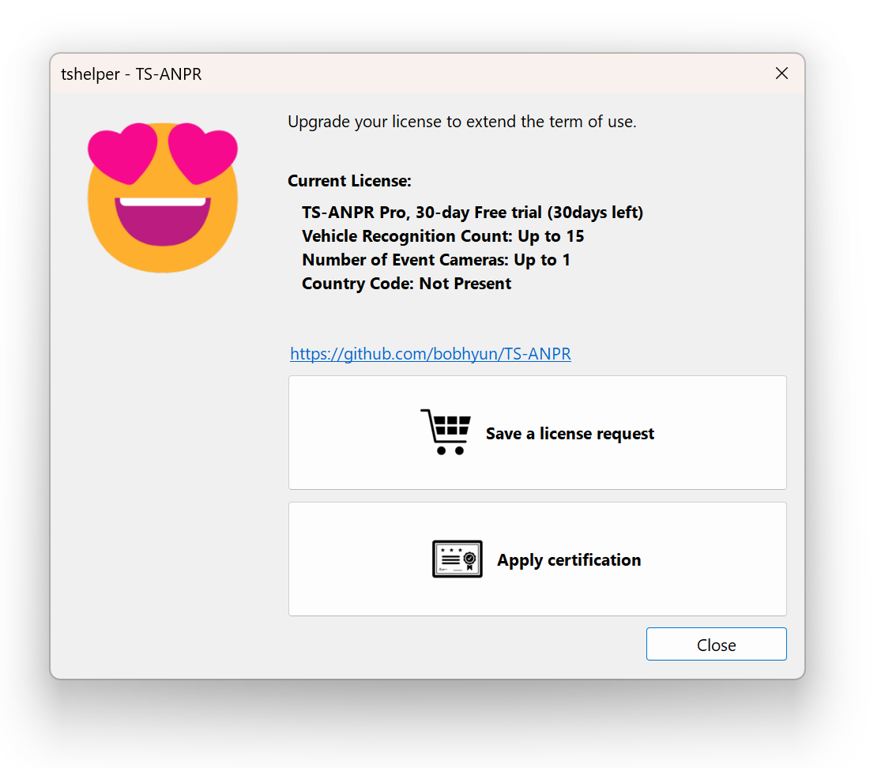

엔진 및 라이선스 설치
===


## 윈도우즈용

anpr 엔진 파일을 설치할 디렉토리에 압축을 해제합니다.

##### x86 64비트 윈도우즈 (windows-x86_64)
```
  /windows-x86_64         # 윈도우즈용 64bit 바이너리 디렉토리  
    tsanpr.dll            # 공유 라이브러리 (API 제공)
    tsanpr-kr-xxxxx.eon   # 딥러닝 모델
    tshelper.exe          # 도우미 앱 (라이선스 관리)
```

##### x86 32비트 윈도우즈 (windows-x86)
```
  /windows-x86            # 윈도우즈용 32bit 바이너리 디렉토리
    tsanpr.dll            # 공유 라이브러리 (API 제공)
    tsanpr-kr-xxxxx.eon   # 딥러닝 모델
    tshelper.exe          # 도우미 앱 (라이선스 관리)
```

`tshelper.exe` 파일을 실행하면 해당 컴퓨터에 `30일 평가판 라이선스`가 자동으로 설치되며, 이 후 30일 동안 `TS-ANPR 프로`의 모든 기능을 사용해 볼 수 있습니다. 


## 리눅스용

### 1. 설치
#### 1.1 파일 압축 해제

anpr 엔진 파일을 설치할 디렉토리에 압축을 해제합니다.

##### x86 64비트 리눅스 (linux-x86_64)

```sh
tar -xvf ts-anpr-v*-linux-x86_64.tar.gz
```

위의 명령을 실행하여 압축 해제된 파일 목록입니다.
```
  /linux-x86_64
    libtsanpr.so          # 공유 라이브러리 (API 제공)
    tsanpr-kr-xxxxx.eon   # 딥러닝 모델
    tshelper              # 도우미 앱 (라이선스 관리)
```

##### ARM 64비트 리눅스 (linux-aarch64)

```sh
tar -xvf ts-anpr-v*-linux-aarch64.tar.gz
```

위의 명령을 실행하여 압축 해제된 파일 목록입니다.
```
  /linux-aarch64 
    libtsanpr.so          # 공유 라이브러리 (API 제공)
    tsanpr-kr-xxxxx.eon   # 딥러닝 모델
    tshelper              # 도우미 앱 (라이선스 관리)
```


#### 1.2. 라이선스 설치

`tshelper` 프로그램으로 라이선스 관리를 합니다.
시스템에 최초로 실행하는 경우 현재 라이선스가 `미설치`로 표시됩니다.

```sh
./tshelper

TS-ANPR v2.1.0 (linux-x86_64)
(C) 2022-2024. TS Solution Corp. all rights reserved.

https://github.com/bobhyun/TS-ANPR

현재 라이선스:
  미설치

사용법:
  --lang, -l [LANG_ID]            # 표시 언어 선택 [ko, en]
  --trial, -t                     # 평가판 라이선스 설치하기
  --req, -r                       # 라이선스 요청서 파일 만들기
  --cert, -c [CERT_FILENAME]      # 라이선스 인증서 파일 설치하기
  --dongle, -d                    # USB 라이선스 동글 환경 설정하기

사용예:
  tshelper -l ko                  # 한국어 표시
  sudo ./tshelper -t              # 평가판 라이선스 설치하기 (root 권한 필요)
  sudo ./tshelper -r              # 라이선스 요청서 파일 만들기 (root 권한 필요)
  sudo ./tshelper -c sample.cert  # 라이선스 인증서 파일 설치하기 (root 권한 필요)
  sudo ./tshelper -d              # USB 라이선스 동글 환경 설정하기 (root 권한 필요)
```

*[참고] 표시되는 언어는 터미널 설정 기본값을 따릅니다. 만약 영문으로 표시되는 경우 아래와 같이 언어를 한글로 표시할 수 있습니다.*
```sh
./tshelper -l ko
```

##### 1.2.1 평가판 라이선스 설치
```sh
sudo ./tshelper -t

TS-ANPR v2.1.0 (linux-x86_64)
(C) 2022-2024. TS Solution Corp. all rights reserved.

https://github.com/bobhyun/TS-ANPR

새 라이선스가 설치되었습니다.

현재 라이선스:
  TS-ANPR 서버, 30일 평가판 (30일 남음)
  동시 인식 차량 수: 최대 15
```

##### 1.2.2 정품 라이선스 (소프트웨어 라이선스)
소프트웨어 라이선스는 시스템별 고유 ID를 식별하여 해당 시스템에서만 동작하는 라이선스를 발급받아 설치하는 방식으로 관리합니다.

###### (1) 라이선스 요청서 만들기
아래 명령으로 생성된 라이선스 요청서 파일을 보내주시면 해당 시스템용 인증서 파일을 발급해 드립니다. 
```sh
sudo ./tshelper -r

TS-ANPR v2.1.0 (linux-x86_64)
(C) 2022-2024. TS Solution Corp. all rights reserved.

https://github.com/bobhyun/TS-ANPR

현재 라이선스:
  TS-ANPR 서버, 30일 평가판 (30일 남음)
  동시 인식 차량 수: 최대 15

라이선스 요청서 파일이 저장되었습니다.

파일명: O20230414-TS-ANPR-8f5b0de4e9eabab6d727ab5c0d4c97e3.req
```

###### (2) 인증서 설치하기
발급받은 정품 인증서 파일은 아래 명령으로 설치합니다. 
```sh
sudo ./tshelper -c C20230414-TS-ANPR-8f5b0de4e9eabab6d727ab5c0d4c97e3.cert

TS-ANPR v2.1.0 (linux-x86_64)
(C) 2022-2024. TS Solution Corp. all rights reserved.

https://github.com/bobhyun/TS-ANPR

새 라이선스가 설치되었습니다.
현재 라이선스:
  TS-ANPR 서버, 정품 라이선스
  동시 인식 차량 수: 최대 15
```

##### 1.2.3 정품 라이선스 (USB 동글 라이선스)
USB 동글 라이선스는 시스템에 USB 동글을 장착하면 즉시 적용됩니다.
단, 리눅스이 경우는 USB 동글을 최초로 삽입하기 전에 아래 명령을 한 번 실행한 후부터 자동 인식됩니다.
```sh
sudo ./tshelper -d
TS-ANPR v2.1.0 (linux-x86_64)
(C) 2022-2024. TS Solution Corp. all rights reserved.

https://github.com/bobhyun/TS-ANPR

USB 라이선스 동글 인식 환경이 설정되었습니다.
이제부터 USB 라이선스 동글을 삽입하면 자동으로 인식됩니다.
USB 동글이 이미 삽입되어 있으면 뺐다가 다시 삽입하세요.
```

### 2. 지원하는 리눅스 배포판
리눅스 시스템의 `glibc 2.27` 이상이면 특정 배포판에 무관하게 호환됩니다.

시스템의 glibc 버전은 아래 명령으로 확인할 수 있습니다.
```sh
ldd --version

ldd (Ubuntu GLIBC 2.35-0ubuntu3.1) 2.35
Copyright (C) 2022 Free Software Foundation, Inc.
This is free software; see the source for copying conditions.  There is NO
warranty; not even for MERCHANTABILITY or FITNESS FOR A PARTICULAR PURPOSE.
Written by Roland McGrath and Ulrich Drepper.
```

호환되는 주요 리눅스 배포판 목록은 다음과 같습니다.
- Ubuntu 18.04 이후 버전
- Debian 10 이후 버전
- CentOS / RHEL / Oracle Linux 8 이후 버전
- Fedora 28 이후 버전

*[참고]* 기타 배포판들의 호환 여부는 distrowatch.com에서 대부분 확인할 수 있습니다.
Slackware를 예를 들면;
https://distrowatch.com/table.php?distribution=slackware
위 링크 화면 가운데 쯤 패키지 목록에서 `glibc` 항목에서 `2.27` 이후 버전을 찾으면 됩니다.


