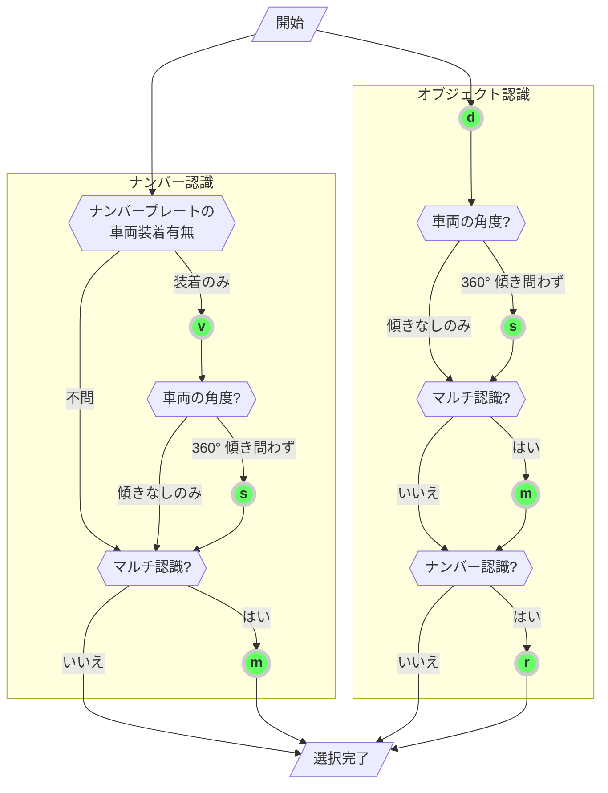

[English](../../DevGuide.md) | 日本語 | [한국어](../ko-KR/DevGuide.md) | [Tiếng Việt](../vi-VN/DevGuide.md)

# アプリケーション開発ガイド

## 目次

- [1. エントリーポイント](#1-エントリーポイント)
  - [1.1. anpr_initialize](#11-anpr_initialize)
  - [1.2. anpr_read_file](#12-anpr_read_file)
  - [1.3. anpr_read_pixels](#13-anpr_read_pixels)
- [2. オプション](#2-オプション)
  - [2.1. ライセンス別サポートオプション一覧](#21-ライセンス別サポートオプション一覧)
  - [2.2. オプション選択ガイド](#22-オプション選択ガイド)
  - [2.3. 関心領域 (RoI) / 関心領域 (RoU) の設定](#23-関心領域-roi--関心領域-rou-の設定)
  - [2.4. 最小ナンバープレートサイズの設定](#24-最小ナンバープレートサイズの設定)
- [3. 出力フォーマット](#3-出力フォーマット)
  - [3.1. 車両ナンバープレート認識結果](#31-車両ナンバープレート認識結果)
    - [3.1.1. text](#311-text)
    - [3.1.2. csv](#312-csv)
    - [3.1.3. json](#313-json)
    - [3.1.4. yaml](#314-yaml)
    - [3.1.5. xml](#315-xml)
  - [3.2. オブジェクト認識結果](#32-オブジェクト認識結果)
    - [3.2.1. csv, text](#321-csv-text)
    - [3.2.2. json](#322-json)
    - [3.2.3. yaml](#323-yaml)
    - [3.2.4. xml](#324-xml)
- [4. エラーコード表](#4-エラーコード表)

## 1. エントリーポイント

すべての関数プロトタイプは以下の通りです。

```cpp
#ifdef WIN32
#define TS_ANPR_ENTRY extern "C" __declspec(dllexport) const char* WINAPI
#else
#define TS_ANPR_ENTRY extern "C" const char*
#endif
```

_長文にならないよう、以下は TS_ANPR_ENTRY と表記します。_

### 1.1. anpr_initialize

ライブラリを初期化します。
ライブラリを使用するために、他の関数よりも先に一度呼び出す必要があります。

```cpp
TS_ANPR_ENTRY anpr_initialize(const char* mode); // [IN] ライブラリの動作モード設定
```

**パラメータ**:

- `mode`
  - ライブラリの動作モードを指定するために使用（従来の `outputFormat` から用途拡張
  - セミコロン (`;`) で区切ることで複数の設定を指定可能 (例: `json;sync`)
    ```python
      # Python例
      # 複数の設定
      err = anpr_initialize(b'json;sync')
    ```
- 指定可能な項目
  - `outputFormat`:
    - 出力データ形式
    - サポートされるデータ形式: `text`, `json`, `yaml`, `xml`, `csv` _(デフォルト: `text`)_
    - `outputFormat` を省略して、単純に `text`, `json` などと指定することも可能
  - `sync`:
    - 同期モードで実行 (スレッドロックをかけて呼び出し順に処理)
    - 事前生成された固定数のスレッドプール形式ではなく、スレッドが連続生成される構造のアプリケーションで呼び出す場合、以下のエラーコード発生時に使用を検討可能
      - `103: Too many workers` ライブラリ呼び出しスレッド数が上限（最大 256 個）を超えた場合
      - `104: Resource exhausted` これ以上リソースを割り当てられない場合
    - 複雑な非同期スレッド管理を気にせずに済む反面、スレッドロック方式のため並列処理性能はやや低下する可能性あり
    - `sync=true` または `sync=false` で指定でき、単純に `sync`だけでも OK（未指定時はデフォルトで `sync=false`)
      ```python
        # Python例
        # 同期モードで実行
        err = anpr_initialize(b'sync')
      ```
  - `minChar`:
    - ナンバープレート認識が成功するための最小文字数を指定
    - `minChar` を指定しない場合や `0`、負数、数値以外の場合はデフォルト値 `4`が適用される
      - 正しい例: `minChar=5` (5 文字以上認識された場合に成功)
        ```python
          # Python例
          # 5文字以上で番号認識成功に設定
          err = anpr_initialize(b'minChar=5')
        ```
      - 誤った例: `minChar=0`, `minChar=-10`, `minChar=二文字` (指定値は無視されデフォルトの `4`が適用)
  - `country`:
    - ナンバープレート認識モデルの国名を指定します。
      - 使用例: `country=JP` (日本のナンバープレート用に設定）
    - 利用可能な国名コード:
      - `KR`: 韓国のナンバープレート
      - `JP`: 日本のナンバープレート
      - `VN`: ベトナムのナンバープレート
        ```python
        # Python例
        # 国名の指定方法
        err = anpr_initialize(b'country=KR')  # 韓国ナンバープレート（デフォルト）
        err = anpr_initialize(b'country=JP')  # 日本ナンバープレート
        err = anpr_initialize(b'country=VN')  # ベトナムナンバープレート
        ```
    - 無料トライアルの場合はアプリケーションで国コードを指定できますが、商用ライセンスの場合は購入したライセンスによって対応国が決まります。
  - `symbol`: _(日本のナンバープレート専用)_
    - 日本のナンバープレートに含まれる `·`、 `-` の出力方法を指定
      - `none`: `·`、 `-` 文字をすべて出力しない (基本値)
      - `zero`: `·` 文字を `0`として出力、 `-` 文字は出力しない
      - `dot`: `·` 文字をそのまま出力、 `-` 文字は出力しない
      - `full`: `·`、 `-` 文字の両方をそのまま出力
        ```python
          # Python例
          # ·, - 文字の全てをそのまま出力
          err = anpr_initialize(b'symbol=full')
        ```

**戻り値**:

- 正常に処理された場合は空のテキスト（`NULL-terminated string（0x00）`）を返します。
- エラーが発生した場合は、`mode` の `outputFormat` で指定したデータ形式の文字列（utf-8 エンコーディング）でエラー内容を返します。

### 1.2. anpr_read_file

画像ファイルから車両ナンバーを認識します。

```cpp
TS_ANPR_ENTRY anpr_read_file(
  const char* imgFileName,  // [IN] 入力画像ファイル名
  const char* outputFormat, // [IN] 出力データ形式
  const char* options);     // [IN] 機能オプション
```

**パラメータ**:

- `imgFileName`:
  - 入力画像ファイル名 _(uutf-8 エンコーディング)_
  - サポートされている画像ファイル形式: `bmp`, `jpg`, `png`, `pnm`, `pbm`, `pgm`, `ppm`, `jfif`, `webp`
- `outputFormat`:
  - 出力データ形式
  - サポートされているデータ形式: `text`, `json`, `yaml`, `xml`, `csv` _(デフォルト: `text`)_
  - オブジェクト認識オプションを使用する場合、 `text`は `csv`로として出力されます。
- `options`:
  - ナンバー認識アルゴリズムのオプションを指定します。
    (参考: [2. Options](#2-options))

**戻り値**:

- `outputFormat`で指定したデータ形式の文字列(utf-8 エンコーディング)でナンバー認識結果を返します。
- 使用した `options`がナンバー認識かオブジェクト認識かによって、`outputFormat` の形式が分かれます。 (参考: [3. Output Format](#3-output-format))

  ```python
    # Python例
    result = anpr_read_file(b'input-image.jpg', b'json', b'vms')
    if len(result) > 0:
        print(result.decode('utf8'))
  ```

  **備考**:

- `戻り値として使用される文字列バッファはライブラリ内部で管理され、アプリケーション側ではそのバッファを参照するだけで構いません。
- この文字列バッファはスレッドセーフであり、各スレッドごとに次回呼び出しまで結果が保持されます。
- 参考サイト
  - https://docs.microsoft.com/ko-kr/windows/win32/medfound/image-stride
  - https://docs.microsoft.com/ko-kr/windows/win32/medfound/video-fourccs

### 1.3. anpr_read_pixels

読み込まれた画像のメモリバッファから車両ナンバーを認識します。
`TS-ANPR v2.3.0`からはエンコードされた画像バッファも入力可能です。

```cpp
TS_ANPR_ENTRY anpr_read_pixels(
  const unsigned char* pixels,  // [IN] 画像ピクセルの開始アドレス
  const unsigned long width,    // [IN] 画像の横ピクセル数
  const unsigned long height,   // [IN] 画像の縦ピクセル数
  const long stride,            // [IN] 画像1ラインあたりのバイト数
  const char* pixelFormat,      // [IN] 画像ピクセルフォーマット
  const char* outputFormat,     // [IN] 出力データ形式
  const char* options);         // [IN] 機能オプション
```

**パラメータ**:

- `pixels`:
  - 画像ピクセルの開始アドレス
- `width`:
  - 画像の横ピクセル数
  - エンコード画像の場合は全バイト数
- `height`:
  - 画像の縦ピクセル数
  - エンコード画像の場合は使用しません（デフォルト値は `0`を指定）
- `stride`:
  - 画像 1 ラインあたりのバイト数（`0`の場合は PADDING 領域なしとみなして自動計算）
  - エンコード画像の場合は使用しません（デフォルト値は `0`を指定）
- `pixelFormat`:
  - 画像ピクセルフォーマット
  - サポートされているピクセルフォーマット:
    - `GRAY`: グレースケール画像 (8bpp)
    - `BGRA`: BGRA (32bpp)
    - `RGBA`: RGBA (32bpp)
    - `RGB`: RGB (24bpp)
    - `BGR`: BGR (24bpp)
    - `BGR555`: BGR (16bpp)
    - `BGR565`: BGR (16bpp)
    - `HSV`: HSV (32bpp)
    - `YCrCb`: YUV444 (32bpp)
    - `I420`: YUV420 (12bpp)
    - `YV12`: YUV420 (12bpp)
    - `IYUV`: YUV420 (12bpp)
    - `NV12`: YUV420 (12bpp)
    - `NV21`: YUV420 (12bpp)
  - サポートされている画像エンコーディング形式:
    - `bmp`, `jpg`, `jpeg`, `png`, `pnm`, `pbm`, `pgm`, `ppm`, `jfif`, `webp`
    - `encoded`を指定すると画像形式を自動認識
- `outputFormat`: _(`anpr_read_file`と同じ)_
- `options`: _(`anpr_read_file`と同じ)_

**戻り値**: _(`anpr_read_file`と同じ)_
**備考**: _(`anpr_read_file`と同じ)_

```python
  # Python例

  # ビデオフレームを入力
  ret, frame = capture.read()
  height = frame.shape[0]
  width = frame.shape[1]
  result = anpr_read_pixels(bytes(frame), width, height, 0, b'BGR', b'json', b'vms')
  if len(result) > 0:
      print(result.decode('utf8'))

  # ウェブサイトの画像を入力
  response = requests.get('https://example.com/image.jpg')
  if response.status_code == 200:
      result = anpr_read_pixels(response.content, 0, 0, 0, b'encoded', b'json', b'vms')
      if len(result) > 0:
          print(result.decode('utf8'))
```

## 2. オプション

- 様々なオプションを指定することで、ナンバープレート認識アルゴリズムを利用環境に合わせて制御できます。

### 2.1. ライセンス別サポートオプション一覧

| 文字 | 意味                                                                 | 対応ライセンス                      |
| ---- | -------------------------------------------------------------------- | ----------------------------------- |
| `v`  | ナンバープレートの車両装着有無判定                                   | 全て                                |
| `b`  | ナンバープレートのバイク装着有無判定（ベトナムナンバープレート専用） | 全て                                |
| `m`  | 複数台の車両ナンバープレートを全て認識（マルチ認識）                 | `オブジェクト認識`, `Pro`, `Server` |
| `s`  | 360° 全方位の車両からナンバープレート認識（サラウンド認識）          | `オブジェクト認識`, `Pro`, `Server` |
| `d`  | オブジェクト認識（満車・空車用）                                     | 全て                                |
| `r`  | 認識されたオブジェクト（車両）のナンバープレート認識                 | 全て                                |
| `i`  | 関心領域（RoI）設定                                                  | 全て                                |
| `x`  | 非関心領域（RoU）設定                                                | 全て                                |
| `a`  | 最小ナンバープレートサイズ設定                                       | 全て                                |

- ライセンスの種類によって、機能およびマルチ認識できる車両数が異なります。（参考: [TS-ANPR エンジン](LICENSE.md#2-ts-anpr-エンジン))

### 2.2. オプション選択ガイド

以下のフローチャートで「`開始`」から「`選択完了`」まで条件に従って進み、通過した緑色の丸の文字をまとめてオプション値として使用します。（文字の順序は関係ありません。）
例）進行経路が「`開始`」→「`v`」→「`s`」→「`m`」→「`選択完了`」の場合、オプション値は `"vsm"` となります。



- 番号認識オプション使用例
  | options | 意味
  |---------|------------------------------------------------------------
  | | 全てのナンバープレートなか 1 つ認識
  | `v` | 車両に装着されたナンバープレートなか 1 つ認識
  | `b` | バイクに取り付けられているナンバープレートのうち一つを認識 (ベトナムナンバープレート専用)
  | `m` | 全てのナンバープレートを認識（マルチ認識）
  | `vm` | 車両に装着されたナンバープレートをマルチ認識
  | `vs` | 車両に装着されたナンバープレート、360° サラウンド認識、1 つ認識
  | `vsm` | 車両に装着されたナンバープレート、360° サラウンド認識、マルチ認識

- オブジェクト認識オプション使用例
  | options | 意味
  |---------|------------------------------------------------------------
  | `d` | 単一オブジェクト認識（車両番号認識なし）
  | `dr` | 単一オブジェクト、車両番号を認識
  | `ds` | 単一オブジェクト、360° サラウンド認識（車両番号認識なし）
  | `dsr` | 単一オブジェクト、360° サラウンド認識、車両番号を認識
  | `dm` | 複数オブジェクト認識（車両番号認識なし）
  | `dmr` | 複数オブジェクト、車両番号を認識（車両番号認識なし）
  | `dms` | 複数オブジェクト、360° サラウンド認識（車両番号認識なし）
  | `dmsr` | 複数オブジェクト、360° サラウンド認識、車両番号を認識

### 2.3. 関心領域 (RoI) / 関心領域 (RoU) の設定


#### 関心領域 (RoI)

- 関心領域は、各頂点のピクセル座標を結んだ多角形領域として表現します。
  - `i` 文字の後に、各頂点のピクセル座標を x, y の順でカンマ区切りで列挙します。
- 関心領域は複数設定することができ、他のナンバープレート認識オプションと組み合わせて使用できます。

#### 非関心領域(RoU)

- 非関心領域は、各頂点のピクセル座標を結んだ多角形領域として表現します。
  - `x` 文字の後に、各頂点のピクセル座標を x, y の順でカンマ区切りで列挙します。
- 非関心領域は複数設定することができ、他のナンバープレート認識オプションと組み合わせて使用できます。

**注意**: 関心領域（RoI）および非関心領域（RoU）のいずれも指定しない場合、画像全体に対してナンバープレート認識が行われます。
関心領域と非関心領域の両方を指定し、それらに重複部分がある場合は、非関心領域が優先されます。そのため、重複部分にあるナンバープレートはすべて無視されます。

```python
# Python例
# 上記画像の各多角形領域の各頂点ピクセル座標が以下の通りの場合:
# RoI = [(810,64), (939,1182), (1486,1182), (1149,571), (879,124), (839,64)]
# RoI2 = [(771,67), (479,1182), (1793,1182), (801,67)]
# RoU = [(851,70), (923,134), (1753,1182), (1789,1182), (1789,250), (1176,87), (946,68)]

# 関心領域（RoI）を一つ設定
result = anpr_read_file(
  b'roi.jpg',    # 入力ファイル名
  b'text',       # 出力形式
  b'vi810,64,939,1182,1486,1182,1149,571,879,124,839,64') # 車両に取り付けられたナンバープレートのみを認識するためにvオプションを使用

# 関心領域（RoI）を二つ設定
result = anpr_read_file(
  b'roi.jpg',    # 入力ファイル名
  b'text',       # 出力形式
  b'vi810,64,939,1182,1486,1182,1149,571,879,124,839,64i771,67,479,1182,1793,1182,801,67')

# 関心領域（RoI）一つと非関心領域（RoU）一つを設定
result = anpr_read_file(
  b'roi.jpg',    # 入力ファイル名
  b'text',       # 出力形式
  b'vi810,64,939,1182,1486,1182,1149,571,879,124,839,64x851,70,923,134,1753,1182,1789,1182,1789,250,1176,87,946,68')

# 非関心領域（RoU）を一つ設定
result = anpr_read_file(
  b'roi.jpg',    # 入力ファイル名
  b'text',       # 出力形式
  b'vx851,70,923,134,1753,1182,1789,1182,1789,250,1176,87,946,68')
```

### 2.4. 最小ナンバープレートサイズの設定

- 最小ナンバープレートサイズは、`a` 文字の後にナンバープレートのバウンディングボックス面積（幅 × 高さのピクセル数）で指定します。例えば、幅が `100` ピクセル、高さが `40` ピクセルの場合は `a4000`と指定します。
- 最小ナンバープレートサイズを指定すると、それより小さいナンバープレートは無視されます。

  ```python
  # Pythonの例
  # 画像内のナンバープレートサイズは 156 x 154 = 24024
  result = anpr_read_file(
    b'test.jpg',  # 入力ファイル名
    b'text',      # 出力形式
    b'vi7,580, 829,293, 1910,325, 1798,1077, 0,1077a24024')  # 関心領域および最小ナンバープレートサイズの指定
  ```

## 3. 出力フォーマット

出力データは、`options`に `d`が含まれるオブジェクト認識と、含まれない車両ナンバープレート認識の 2 つの形式に分かれます。

### 3.1. 車両ナンバープレート認識結果

### 3.1.1. `text`

車両ナンバープレートのテキストのみを出力します。
ナンバープレートが複数ある場合は、改行文字 `CR (0x0d)`で区切ります。

```text
香川900さ464
札幌330ほ5419
```

ナンバープレートが認識されなかった場合は、空のテキスト(`NULL terminated string (0x00)`)を出力します。

エラーが返される場合は、以下のようなテキスト形式で出力されます。

```text
error: (1) Invalid parameters
```

##### 3.1.2. `csv`

車両ナンバープレートおよび属性情報を `csv` 形式で出力します。
認識されたナンバープレートごとに 1 行ずつ出力され、各カラムはカンマ（`,`）で区切られます。

```csv
香川900さ464,1217,2083,92,175,12.45,0.75,0.83,0.20,ev
札幌330ほ5419,1108,1317,67,217,12.45,0.76,0.89,0.10,
```

各カラムの意味は以下の通りです。
| カラム | 意味 | 備考
|-----:|---------------------------|------------------------
| 1 | 車両ナンバー | `text`
| 2 | ナンバープレート左上 x 座標 | `area.x`
| 3 | ナンバープレート左上 y 座標 | `area.y`
| 4 | ナンバープレート幅 | `area.width`
| 5 | ナンバープレート高さ | `area.height`
| 6 | ナンバープレート角度 | `area.angle`
| 7 | 文字認識信頼度 | `conf.ocr`
| 8 | ナンバープレート認識信頼度 | `conf.plate`
| 9 | 文字認識所要時間（秒） | `elapsed`
| 10<sup>(1)</sup> | 環境対応電気自動車かどうか | `attr.ev`

- <sup>(1)</sup> (韓国のナンバープレートのみ対象) 環境対応電気自動車の場合は `ev`が出力され、それ以外は空欄となります。

ナンバープレートが認識されなかった場合は、空のテキスト(`NULL terminated string (0x00)`)を出力します。

エラーが返される場合は、以下のようなテキスト形式で出力されます。

```csv
error,1,Invalid parameters
```

### 3.1.3. `json`

車両ナンバープレートおよび属性情報を `json` 形式で出力します。

```jsx
[
  {
    // 1枚目のナンバープレート
    text: "香川900さ464", // 車両ナンバー
    area: {
      // ナンバープレート領域（ピクセル単位）
      x: 1217, // 左上 x座標
      y: 2083, // 左上 y座標
      width: 92, // 幅
      height: 175, // 高さ
      angle: 12.45, // 傾き（度）
    },
    attrs: {
      // ナンバープレート属性
      ev: true, // 環境対応電気自動車かどうか
    },
    ev: true, // 非推奨（attrs.evに移行、将来のバージョンで削除予定）
    conf: {
      // 信頼度（範囲: 0 ~ 1）
      ocr: 0.75, // 文字認識信頼度
      plate: 0.84, // ナンバープレート認識信頼度
    },
    elapsed: 0.27, //  所要時間（秒単位）
  },
  {
    // 2枚目のナンバープレート
    text: "札幌330ほ5419",
    area: {
      x: 1108,
      y: 1317,
      width: 67,
      height: 217,
      angle: 12.45,
    },
    attrs: {
      ev: false,
    },
    ev: false,
    conf: {
      ocr: 0.76,
      plate: 0.89,
    },
    elapsed: 0.14,
  },
];
```

ナンバープレートが認識されなかった場合は、以下のように空データを出力します。

```jsx
[];
```

エラーが返される場合は、以下のような `json` 形式で出力されます。

```jsx
{
  "error": {
    "code": 1,
    "message": "Invalid parameters"
  }
}
```

### 3.1.4. `yaml`

車両ナンバープレートおよび属性情報を `yaml` 形式で出力します。

```yaml
- text: 香川900さ464 # 1枚目のナンバープレート、車両ナンバー
  area: # ナンバープレート領域（ピクセル単位）
    x: 1217 # 左上 x座標
    y: 2083 # 左上 x座標
    width: 92 # 幅
    height: 175 # 高さ
    angle: 12.45 # 傾き（度）
  conf: # 信頼度（範囲: 0 ~ 1）
    ocr: 0.75 # 文字認識信頼度
    plate: 0.83 # ナンバープレート認識信頼度
  attrs: # ナンバープレート属性
    ev: true # 環境対応電気自動車かどうか
  ev: true # 非推奨（attrs.evに移行、将来のバージョンで削除予定）
  elapsed: 0.20 # 所要時間（秒）
- text: 札幌330ほ5419 # 2枚目のナンバープレート
  area:
    x: 1108
    y: 1317
    width: 67
    height: 217
    angle: 12.45
  conf:
    ocr: 0.76
    plate: 0.89
  ev: false
  elapsed: 0.10
```

ナンバープレートが認識されなかった場合は、以下のように空データを出力します。

```yaml

```

エラーが返される場合は、以下のような `yaml` 形式で出力されます。

```yaml
error
  code: 1
  message: Invalid parameters
```

### 3.1.5. `xml`

車両ナンバープレートおよび属性情報を `xml` 形式で出力します。

```xml
<?xml version="1.0" encoding="utf-8"?>
<data>
  <!-- 1枚目のナンバープレート
    text: 車両ナンバー
    ev: 非推奨（attrs.evに移行、将来のバージョンで削除予定）
    elapsed: 所要時間（秒）
  -->
  <license-plate text="香川900さ464" ev="true" elapsed="0.20">
    <!-- ナンバープレート属性
      ev: 環境対応電気自動車かどうか
    -->
    <attrs ev="true"/>
    <!-- ナンバープレート領域（ピクセル単位）
      x: 左上 x座標
      y: 左上 y座標
      width: 幅
      height: 高さ
      angle: 傾き（度）
    -->
    <area x="1217" y="2083" width="92" height="175" angle="12.45"/>
    <!-- 信頼度（範囲: 0 ~ 1）
      ocr: 文字認識信頼度
      plate: ナンバープレート認識信頼度
    -->
    <conf ocr="0.75" plate="0.83"/>
  </license-plate>
  <!-- 2枚目のナンバープレート -->
  <license-plate text="札幌330ほ5419" ev="false" elapsed="0.11">
    <attrs ev="false"/>
    <area x="1108" y="1317" width="67" height="217"/>
    <conf ocr="0.76" plate="0.89"/>
  </license-plate>
</data>
```

ナンバープレートが認識されなかった場合は、以下のように空データを出力します。

```xml
<?xml version="1.0" encoding="utf-8"?>
<data />
```

エラーが返される場合は、以下のような `xml` 形式で出力されます。

```xml
<?xml version="1.0" encoding="utf-8"?>
<error code="1" message="Invalid parameters" />
```

#### 3.2. オブジェクト認識結果

画像から事前に学習したオブジェクトを検出します。
特徴的なのは、360° 魚眼レンズカメラで撮影された元画像において、歪んだ形状のオブジェクトも認識できる点です。
現在サポートしているオブジェクトの一覧は以下の通りです。
| class | 名前  
|--------------|----------------------------------
| `car` | 車両
| `motorcycle` | オートバイ

##### 3.2.1. `csv`, `text`

オブジェクト認識結果を `cvs` 形式のテキストで出力します。
出力形式を `text`に指定した場合も、`csv` 形式で出力されます。

認識されたオブジェクトごとに 1 行ずつ出力され、各カラムはカンマ（`,`）で区切られます。

```csv
car,2171,2281,396,521,0.9679,0.2886,山梨88せ5059,2420,2295,110,81,147.5933,0.9005,0.7864,0.3913,ev
car,264,2266,433,543,0.9706,0.2886,京都11に211,315,2281,103,81,211.3135,0.9160,0.8299,0.4189,
car,777,0,579,403,0.9716,0.2886 // ナンバープレート情報がない場合
```

各カラムの意味は以下の通りです。
| カラム | 意味 | 備考
|-----:|-----------------------------------|------------------------
| 1 | 種類 | `class`
| 2 | オブジェクト左上 x 座標 | `area.x`
| 3 | オブジェクト左上 y 座標 | `area.y`
| 4 | 幅 | `area.width`
| 5 | 高さ | `area.height`
| 6 | 信頼度 | `conf`
| 7 | 所要時間（秒） | `elapsed`
| 8<sup>(1)</sup> | 車両ナンバー | `licensePlate.text`
| 9 | ナンバープレート x 座標 | `licensePlate.area.x`
| 10 | ナンバープレート y 座標 | `licensePlate.area.y`
| 11 | ナンバープレート幅 | `licensePlate.area.width`
| 12 | ナンバープレート高さ | `licensePlate.area.height`
| 13 | ナンバープレート角度 | `licensePlate.area.angle`
| 14 | 文字認識信頼度 | `licensePlate.conf.ocr`
| 15 | ナンバープレート認識信頼度 | `licensePlate.conf.plate`
| 16 | 文字認識所要時間（秒）| `licensePlate.elapsed`
| 17<sup>(2)</sup> | 環境対応電気自動車かどうか | `licensePlate.attrs.ev`

- <sup>(1)</sup> 8 列目以降は、`r` オプションを使用して車両ナンバーが認識された場合のみ出力され、それ以外は以降のカラムが全て省略されます。
- <sup>(2)</sup> (韓国のナンバープレートのみ対象) 17 列目は環境対応電気自動車と認識された場合は `ev`と出力され、それ以外は空欄になります。

オブジェクトが認識されなかった場合は、空のテキスト(`NULL terminated string (0x00)`)を出力します。

エラーが返される場合は、以下のようなテキスト形式で出力されます。

```csv
error,1,Invalid parameters
```

##### 3.2.2. `json`

オブジェクト認識結果を `json` 形式で出力します。

```jsx
 [
  {                           // 1つ目のオブジェクト
    "class": "car",           // オブジェクト種別
    "area": {                 // オブジェクト領域（ピクセル単位）
      "x": 2171,              // 左上 x座標
      "y": 2281,              // 左上 y座標
      "width": 396,           // 幅
      "height": 521           // 高さ
    },
    "conf": 0.9679,           // オブジェクト認識信頼度（範囲: 0 ~ 1）
    "elapsed": 0.2513,        // 所要時間（秒）
    "licensePlate": [         // ナンバープレート
      {
        "text": "山梨88せ5059"    // 車両ナンバー
        "area": {             // ナンバープレート領域（ピクセル単位）
          "x": 2420,          // 左上 x座標
          "y": 2295           // 左上 y座標
          "width": 110,       // 幅
          "height": 81,       // 高さ
          "angle": 147.5933   // 傾き（度）
        },
        "attrs": {            // ナンバープレート属性
          "ev": true          // 環境対応電気自動車かどうか
        },
        "conf": {             // 信頼度（範囲: 0 ~ 1）
          "ocr": 0.9005,      // 文字認識信頼度
          "plate": 0.7864     // ナンバープレート認識信頼度
        },
        "elapsed": 0.3525,    // 所要時間（秒）
      }
    ]
  },
  {                           // 2つ目のオブジェクト
    "class": "car",
    "area": {
      "x": 264,
      "y": 2266,
      "width": 433,
      "height": 543
    },
    "conf": 0.9706,
    "elapsed": 0.2513,
    "licensePlate": [
      {
        "text": "京都11に211"
        "area": {
          "x": 315,
          "y": 2281,
          "width": 103,
          "height": 81,
          "angle": 211.3135
        },
        "attrs": {
          "ev": false
        },
        "conf": {
          "ocr": 0.916,
          "plate": 0.8299
        },
        "elapsed": 0.4402
      }
    ]
  },
  {                           // 3つ目のオブジェクト（ナンバープレート情報がない場合）
    "class": "car",
    "area": {
      "x": 777,
      "y": 0
      "height": 403,
      "width": 579,
    },
    "conf": 0.9716,
    "elapsed": 0.2513
  }
]
```

オブジェクトが認識されなかった場合は、以下のように空データを出力します。

```jsx
[];
```

エラーが返される場合は、以下のような `json` 形式で出力されます。

```jsx
{
  "error": {
    "code": 1,
    "message": "Invalid parameters"
  }
}
```

##### 3.2.3. `yaml`

オブジェクト認識結果を `yaml` 形式で出力します。

```yaml
- class: car # 1つ目のオブジェクト、オブジェクト種別
  area: # オブジェクト領域（ピクセル単位）
    x: 2171 # 左上 x座標
    y: 2281 # 左上 y座標
    width: 396 # 幅
    height: 521 # 高さ
  conf: 0.9678 # オブジェクト認識信頼度（範囲: 0 ~ 1）
  elapsed: 0.3190 # 所要時間（秒）
  licensePlate: # ナンバープレート
    - text: 山梨88せ5059 # 車両ナンバー
      area: # ナンバープレート領域（ピクセル単位）
        x: 2420 # 左上 x座標
        y: 2295 # 左上 y座標
        width: 110 # 幅
        height: 81 # 高さ
        angle: 147.5933 # 傾き（度）
      attrs: # ナンバープレート属性
        ev: true # 環境対応電気自動車かどうか
      conf: # 信頼度（範囲: 0 ~ 1）
        ocr: 0.9005 # 文字認識信頼度
        plate: 0.7864 # ナンバープレート認識信頼度
      elapsed: 0.3226 # 所要時間（秒）
- class: car # 2つ目のオブジェクト
  area:
    x: 264
    y: 2266
    width: 433
    height: 543
  conf: 0.9706
  elapsed: 0.3191
  licensePlate:
    - text: 京都11に211
      area:
        x: 315
        y: 2281
        width: 103
        height: 81
        angle: 211.3135
      conf:
        ocr: 0.916
        plate: 0.8299
      attrs:
        ev: false
      elapsed: 0.5527
- class: car # 3つ目のオブジェクト（ナンバープレート情報がない場合）
  area:
    x: 777
    y: 0
    width: 579
    height: 403
  conf: 0.9716
  elapsed: 0.3191
```

オブジェクトが認識されなかった場合は、以下のように空データを出力します。

```yaml

```

エラーが返される場合は、以下のような `yaml` 形式で出力されます。

```yaml
error
  code: 1
  message: Invalid parameters
```

##### 3.2.4. `xml`

オブジェクト認識結果を `xml` 形式で出力します。

```xml
<?xml version="1.0" encoding="utf-8"?>
<data>
  <!-- 1つ目のオブジェクト
    class: オブジェクト種別
    conf: オブジェクト認識信頼度（範囲: 0 ~ 1）
    elapsed: 所要時間（秒）
  -->
  <object class="car" conf="0.9679" elapsed="0.3287">
    <!-- オブジェクト領域（ピクセル単位）
      x: 左上 x座標
      y: 左上 y座標
      width: 幅
      height: 高さ
    -->
    <area x="2171" y="2281" width="396" height="521"/>

    <!-- ナンバープレート
      text: 車両ナンバー
      elapsed: 所要時間（秒）
    -->
    <license-plate text="山梨88せ5059" elapsed="0.3961">

      <!-- ナンバープレート属性
        ev: 環境対応電気自動車かどうか
      -->
      <attrs ev="true"/>

      <!-- ナンバープレート領域（ピクセル単位）
        x: 左上 x座標
        y: 左上 y座標
        width: 幅
        height: 高さ
        angle: 傾き（度）
      -->
      <area x="2420" y="2295" width="110" height="81" angle="147.5933"/>

      <!-- 信頼度（範囲: 0 ~ 1）
        ocr: 文字認識信頼度
        plate: ナンバープレート認識信頼度
      -->
      <conf ocr="0.9005" plate="0.7864"/>
    </license-plate>
  </object>

  <!-- 2つ目のオブジェクト -->
  <object class="car" conf="0.9706" elapsed="0.3287">
    <area x="264" y="2266" width="433" height="543"/>
    <license-plate text="京都11に211" elapsed="0.4364">
      <attrs ev="false"/>
      <area x="315" y="2281" width="103" height="81" angle="211.3135"/>
      <conf ocr="0.9160" plate="0.8299"/>
    </license-plate>
  </object>

  <!-- 3つ目のオブジェクト（ナンバープレート情報がない場合） -->
  <object class="car" conf="0.9716" elapsed="0.3287">
    <area x="777" y="0" width="579" height="403"/>
  </object>
</data>
```

オブジェクトが認識されなかった場合は、以下のように空データを出力します。

```xml
<?xml version="1.0" encoding="utf-8"?>
<data />
```

エラーが返される場合は、以下のような `xml` 形式で出力されます。

```xml
<?xml version="1.0" encoding="utf-8"?>
<error code="1" message="Invalid parameters" />
```

## 4. エラーコード表

全エラー一覧は以下の表の通りです。

|  code | message                    | 説明                                                                                                     |
| ----: | -------------------------- | -------------------------------------------------------------------------------------------------------- |
|   `1` | `Invalid parameters`       | 関数呼び出しの引数が正しくない場合                                                                       |
|   `2` | `File not found`           | 入力画像ファイルが存在しない場合                                                                         |
|   `3` | `Invalid image`            | 入力画像メモリが形式に合っていない場合                                                                   |
|   `4` | `Unsupported image format` | 入力画像がサポートされていない形式の場合                                                                 |
| `100` | `License expired`          | ライセンスが期限切れの場合                                                                               |
| `101` | `Corrupted library`        | ライブラリ構成ファイルの一部が存在しないか、破損している場合                                             |
| `102` | `Not initialized`          | エンジンが初期化されていない状態                                                                         |
| `103` | `Too many workers`         | ライブラリ呼び出しスレッド数が上限（最大 256 個）を超えた場合                                            |
| `104` | `Resource exhausted`       | これ以上リソースを割り当てできない場合                                                                   |
| `105` | `License not installed`    | ライセンスがインストールされていない状態（無料トライアルライセンスがインストールされていない場合に発生） |
| `106` | `USB dongle I/O error`     | USB ライセンスドングルの読み取りに失敗した場合                                                           |
| `107` | `License required`         | 該当機能を利用するためのライセンスがない場合                                                             |
| `108` | `Unsupported platform`     | サポートされていない環境で実行された場合                                                                 |
| `200` | `Unknown`                  | その他の未定義エラー                                                                                     |
