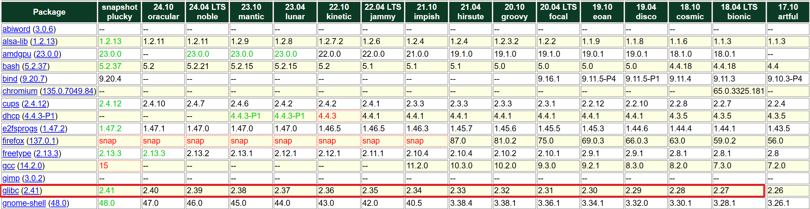

[English](../../Usage.md) | [한국어](../ko-KR/Usage.md) | 日本語 | [Tiếng Việt](../vi-VN/Usage.md)

# エンジンおよびライセンスのインストール

## Windows 用

anpr エンジンファイルをインストールするディレクトリに解凍します。

##### x86 64 ビット Windows (windows-x86_64)

```
  /windows-x86_64         # Windows用 64 ビット バイナリディレクトリ
    tsanpr.dll            # 共有ライブラリ (API提供)
    tsanpr-xx-xxxxx.eon   # ディープラーニングモデル
    tshelper.exe          # ヘルパーアプリ (ライセンス管理用)
```

##### x86 32 ビット Windows (windows-x86)

```
  /windows-x86            # Windows用 32 ビット バイナリディレクトリ
    tsanpr.dll            # 共有ライブラリ (API提供)
    tsanpr-xx-xxxxx.eon   # ディープラーニングモデル
    tshelper.exe          # ヘルパーアプリ (ライセンス管理用)
```

`tshelper.exe`ファイルを実行すると、そのコンピュータに**30 日間の評価版ライセンス**が自動的にインストールされ、その後 30 日間 **TS-ANPR Pro** のすべての機能を試すことができます。


## Linux 用

### 1. インストール

#### 1.1 ファイルの圧縮を解除

ANPR エンジンファイルをインストールするディレクトリに圧縮を解凍します。

##### x86 64 ビット Linux (linux-x86_64)

```sh
tar -xvf tsanpr-v*-linux-x86_64.tar.gz
```

上記のコマンドを実行して圧縮解除されたファイルの一覧です。

```
  /linux-x86_64           # x86 Linux用 64ビットバイナリディレクトリ
    libtsanpr.so          # 共有ライブラリ (API提供)
    tsanpr-xx-xxxxx.eon   # ディープラーニングモデル
    tshelper              # ヘルパーアプリ (ライセンス管理用)
```

##### ARM 64 ビット Linux (linux-aarch64)

```sh
tar -xvf tsanpr-v*-linux-aarch64.tar.gz
```

上記のコマンドを実行して圧縮解凍されたファイルの一覧です。

```
  /linux-aarch64          # ARM Linux用 64ビットバイナリディレクトリ
    libtsanpr.so          # 共有ライブラリ (API提供)
    tsanpr-xx-xxxxx.eon   # ディープラーニングモデル
    tshelper              # ヘルパーアプリ (ライセンス管理用)
```

#### 1.2. ライセンスのインストール

`tshelper` プログラムでライセンスを管理します。
システムに初めて実行する場合、現在のライセンスは `未設置` と表示されます。

```sh
./tshelper

TS-ANPR v2.6.0 (linux-x86_64)
(C) 2022-2025. TS Solution Corp. all rights reserved.

https://github.com/bobhyun/TS-ANPR

現在のライセンス:
  未インストール

使用方法:
  --lang, -l [LANG_ID]            # 表示言語の選択 [en, ja, ko, vi]
  --trial, -t                     # 試用版ライセンスのインストール
  --req, -r                       # ライセンス要求ファイルの作成
  --cert, -c [CERT_FILENAME]      # ライセンス認証ファイルのインストール
  --dongle, -d                    # USBライセンスドングル環境の設定

使用例:
  ./tshelper -l ja                # 日本語で表示
  sudo ./tshelper -t              # 試用版ライセンスのインストール (root権限が必要です)
  sudo ./tshelper -r              # ライセンス要求ファイルの作成 (root権限が必要です)
  sudo ./tshelper -c sample.cert  # ライセンス認証ファイルのインストール (root権限が必要です)
  sudo ./tshelper -d              # USBライセンスドングル環境の設定 (root権限が必要です)
```

_**注**: 表示される言語はターミナルの設定のデフォルトに従います。もし日本語で表示したい場合は、以下のように設定できます。_

```sh
./tshelper -l ja
```

##### 1.2.1 評価版ライセンスのインストール

```sh
sudo ./tshelper -t

TS-ANPR v2.6.0 (linux-x86_64)
(C) 2022-2025. TS Solution Corp. all rights reserved.

https://github.com/bobhyun/TS-ANPR

新しいライセンスがインストールされました。

現在のライセンス:
  TS-ANPR プロ, 30日 無料トライアル (30日残り)
  イベントカメラ数: 最大 15
```

##### 1.2.2 正規版ライセンス（ソフトウェアライセンス）

ソフトウェアライセンスは、システムごとに固有の ID を識別して、そのシステムでのみ動作するライセンスを発行してインストールする方式で管理します。

###### (1) ライセンスリクエストファイルの作成

以下のコマンドで生成されたライセンスリクエストファイルを送信していただければ、そのシステム用の認証書ファイルを発行いたします。

```sh
sudo ./tshelper -r

TS-ANPR v2.6.0 (linux-x86_64)
(C) 2022-2025. TS Solution Corp. all rights reserved.

https://github.com/bobhyun/TS-ANPR

現在のライセンス:
  TS-ANPR プロ, 30日 無料トライアル (30日残り)
  イベントカメラ数: 最大 15

ライセンス要求ファイルが保存されました。

ファイル名: O20250414-TS-ANPR-8f5b0de4e9eabab6d727ab5c0d4c97e3.req
```

###### (2) 認証書のインストール

発行された正規版認証書ファイルは、以下のコマンドでインストールします。

```sh
sudo ./tshelper -c C20250414-TS-ANPR-8f5b0de4e9eabab6d727ab5c0d4c97e3.cert

TS-ANPR v2.6.0 (linux-x86_64)
(C) 2022-2025. TS Solution Corp. all rights reserved.

https://github.com/bobhyun/TS-ANPR

新しいライセンスがインストールされました。
現在のライセンス:
  TS-ANPR プロ, 正規ライセンス
  イベントカメラ数: 最大 15
```

##### 1.2.3 正規ライセンス（USB ドングルライセンス）

USB ドングルライセンスは、システムに USB ドングルを接続すると即座に適用されます。ただし、Linux の場合は、USB ドングルを最初に挿入する前に以下のコマンドを一度実行してから自動認識されます。

```sh
sudo ./tshelper -d
TS-ANPR v2.6.0 (linux-x86_64)
(C) 2022-2025. TS Solution Corp. all rights reserved.

https://github.com/bobhyun/TS-ANPR

USBライセンスドングルの認識環境が設定されました。
これからはUSBライセンスドングルを挿入すると自動的に認識されます。
USBドングルがすでに挿入されている場合は、一度抜いて再度挿入してください。
```

### 2. サポートされている Linux ディストリビューション

Linux システムの`glibc 2.27`以上であれば、特定のディストリビューションに関係なく互換性があります。
システムの`glibc`バージョンは、以下のコマンドで確認できます。

```sh
ldd --version

ldd (Ubuntu GLIBC 2.35-0ubuntu3.1) 2.35
Copyright (C) 2022 Free Software Foundation, Inc.
This is free software; see the source for copying conditions.  There is NO
warranty; not even for MERCHANTABILITY or FITNESS FOR A PARTICULAR PURPOSE.
Written by Roland McGrath and Ulrich Drepper.
```

互換性のある主要な Linux ディストリビューションのリストは以下の通りです。

- Ubuntu 18.04 以降のバージョン
- Debian 10 以降のバージョン
- CentOS / RHEL / Oracle Linux 8 以降のバージョン
- Fedora 28 以降のバージョン

_**注**: その他のディストリビューションの互換性は、distrowatch.com でほとんど確認できます。
Ubuntu を例に挙げると、以下のリンクの画面中央付近にあるパッケージリストの glibc 項目で 2.27 以降のバージョンを探してください。_
https://distrowatch.com/table.php?distribution=ubuntu

