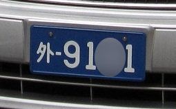
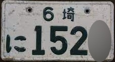

[English](/TS-ANPR/) | [한국어](/TS-ANPR/doc.i18n/ko-KR/) | 日本語 | [Tiếng Việt](/TS-ANPR/doc.i18n/vi-VN/)

# 😍TS-ANPR

**TS-ANPR**は、ディープラーニングベースの車両ナンバープレート認識エンジンで、韓国、日本、ベトナムのナンバープレート規格に対応しています。

##### [😍 ライブデモ](http://tsnvr.ipdisk.co.kr/) 👈 ここで番号認識の性能を直接ご確認ください。

##### [🚀 最新エンジンのダウンロード](https://github.com/bobhyun/TS-ANPR/releases/)

##### 🎨 プログラミング言語別コード例

| # | 言語 | 人気度 | # | 言語 | 人気度 |
|--:|:---------|:-----------|--:|:---------|:-----------|
| 1 | [Python](../../examples/Python/anpr/) | ⭐⭐⭐⭐⭐ | 2 | [C](../../examples/C/anpr/) | ⭐⭐⭐⭐⭐ |
| 3 | [Java](../../examples/Java/anpr/) | ⭐⭐⭐⭐⭐ | 4 | [C++](../../examples/C++/anpr/) | ⭐⭐⭐⭐⭐ |
| 5 | [C#](../../examples/C%23/anpr/) | ⭐⭐⭐⭐⭐ | 6 | [JavaScript](../../examples/JavaScript/anpr/) | ⭐⭐⭐⭐ |
| 7 | [VB.NET](../../examples/VB.NET/anpr/) | ⭐⭐⭐⭐ | 8 | [TypeScript](../../examples/TypeScript/anpr/) | ⭐⭐⭐ |
| 9 | [Go](../../examples/Go/anpr/) | ⭐⭐⭐ | 10 | [Rust](../../examples/Rust/anpr/) | ⭐⭐⭐ |
| 11 | [Kotlin](../../examples/Kotlin/anpr/) | ⭐⭐⭐ | 12 | [Swift](../../examples/Swift/anpr/) | ⭐⭐⭐ |
| 13 | [Ruby](../../examples/Ruby/anpr/) | ⭐⭐⭐ | 14 | [Dart](../../examples/Dart/anpr/) | ⭐⭐ |
| 15 | [Scala](../../examples/Scala/anpr/) | ⭐⭐ | 16 | [R](../../examples/R/anpr/)&nbsp;New | ⭐⭐ |
| 17 | [Perl](../../examples/Perl/anpr/) | ⭐⭐ | 18 | [Lua](../../examples/Lua/anpr/) | ⭐⭐ |
| 19 | [Julia](../../examples/Julia/anpr/) | ⭐⭐ | 20 | [MATLAB](../../examples/MATLAB/anpr/) | ⭐⭐ |
| 21 | [Delphi](../../examples/Delphi/anpr/) | ⭐⭐ | 22 | [Haskell](../../examples/Haskell/anpr/) | ⭐⭐ |
| 23 | [Elixir](../../examples/Elixir/anpr/) | ⭐⭐ | 24 | [PHP](../../examples/PHP/anpr/)&nbsp;New | ⭐⭐ |
| 25 | [Groovy](../../examples/Groovy/anpr/)&nbsp;New | ⭐⭐ | 26 | [Clojure](../../examples/Clojure/anpr/) | ⭐ |
| 27 | [F#](../../examples/F%23/anpr/) | ⭐ | 28 | [OCaml](../../examples/OCaml/anpr/)&nbsp;New | ⭐ |
| 29 | [Erlang](../../examples/Erlang/anpr/) | ⭐ | 30 | [Fortran](../../examples/Fortran/anpr/) | ⭐ |
| 31 | [COBOL](../../examples/COBOL/anpr/) | ⭐ | 32 | [Ada](../../examples/Ada/anpr/) | ⭐ |
| 33 | [Pascal](../../examples/Pascal/anpr/)&nbsp;New | ⭐ | 34 | [D](../../examples/D/anpr/) | ⭐ |
| 35 | [Nim](../../examples/Nim/anpr/)&nbsp;New | ⭐ | 36 | [Crystal](../../examples/Crystal/anpr/) | ⭐ |
| 37 | [Zig](../../examples/Zig/anpr/) | ⭐ | 38 | [V](../../examples/V/anpr/)&nbsp;New | ⭐ |
| 39 | [Odin](../../examples/Odin/anpr/)&nbsp;New | ⭐ | 40 | [Gleam](../../examples/Gleam/anpr/) | ⭐ |
| 41 | [Mojo](../../examples/Mojo/anpr/)&nbsp;New | ⭐ | 42 | [Pony](../../examples/Pony/anpr/)&nbsp;New | ⭐ |

##### 📖 アプリ開発ガイド

- [TS-ANPR](DevGuide.md)
- [TS-CAM](https://github.com/bobhyun/TS-CAM/blob/main/DevGuide.md)

##### [🎁 インストール手順](Usage.md)

##### [⚖️ ライセンス](license_page.md)

##### ✨ アプリケーションの例 (TS-IVR)

<iframe width="720" height="405" src="https://www.youtube.com/embed/d7UU71PAx5Y" title="YouTube video player" frameborder="0" allow="accelerometer; autoplay; clipboard-write; encrypted-media; gyroscope; picture-in-picture; web-share" allowfullscreen></iframe>

_ご質問やご要望がございましたら、[Issues](https://github.com/bobhyun/TS-ANPR/issues) にお気軽にご投稿ください。
皆さまからのフィードバックやご連絡をお待ちしております！_

- お問い合わせ: 📧 skju3922@naver.com

---

## 目次

- [最新バージョン情報](#最新バージョン情報)
- [ディープラーニングモデルの種類とその用途](#ディープラーニングモデルの種類とその用途)
- [ディープラーニングモデル別認識速度比較表](#ディープラーニングモデル別認識速度比較表)
- [特長点](#特長点)
- [多様な認識オプション](#多様な認識オプション)

 

---

## 最新バージョン情報

#### v3.1.7 リリース (2026.1.15)🎉
1. 韓国の5文字仮ナンバープレート規格対応

#### v3.1.6 リリース (2025.12.10)🎉
1. 韓国ナンバープレート認識率の向上
2. v3.1.5で特定の条件下でクラッシュが発生する可能性を修正。
   - *v3.1.5は廃止されました。*

#### v3.1.4 リリース (2025.10.17)🎉

1. `anpr_read_pixels`関数で`stride`値が負の場合に誤認識が発生する問題を修正しました。
2. 物体認識で`r`オプションを使用せず`d`オプションのみを使用した場合、オートバイの物体が結果から除外される問題を修正しました。

#### v3.1.3 リリース (2025.9.29)🎉

1. 韓国ナンバープレート認識率の向上 特に `S` モデルの向上が大きい）
2. 毎回新しいスレッドでナンバー認識 が呼び出される場合に発生する `103: Too many workers` エラーを防止
   - 終了したスレッドのリソースを自動的に解放するよう改善し、同時に 256 個以上のスレッド を使用しない限り発生しないようにした

#### v3.1.2 リリース (2025.8.29)🎉

1. `sync` パラメータでエンジンを初期化した後、マルチスレッド環境で競合的にナンバープレート認識を呼び出す場合にクラッシュが発生する可能性があるため修正しました。

#### v3.1.1 リリース (2025.8.18)🎉

1. `dr` オプションで車両とナンバープレートを同時に認識する際、ナンバープレートが見えない車両が結果から除外される問題があったため、修正しました。

#### v3.1.0 リリース (2025.8.1)🎉

1. 認識率の向上
   - 日本および韓国のナンバープレート認識率が向上しました。

## ディープラーニングモデルの種類とその用途

ライセンスはすべてのディープラーニングモデルに適用されるため、用途に最も適したモデルを選択するだけで構いません。

| モデル |      認識速度       | 適用例                                                                                                                                                                                                                                                  |
| :----: | :-----------------: | :------------------------------------------------------------------------------------------------------------------------------------------------------------------------------------------------------------------------------------------------------ |
| **S**  | 速い (近距離用) | 駐車場の入出管理                                                                                                                                                                                           |
| **M**  | 普通 (中距離用) | 駐車スペース満空管理／駐車位置検索  魚眼レンズカメラ（360° 全方位認識）  転覆車両（360° 全方位認識）  |
| **L**  | 遅い (長距離用) | 大規模屋外駐車場／車両台数カウント  多車線車両ナンバープレート認識  通行量集計                           |

## ディープラーニングモデル別認識速度比較表

| CPU                               | コア数 | スレッド数 | クロック(1) | OS                                    | S(2) | M(2) | L(2) |
| --------------------------------- | -----: | ---------: | ---------------------: | :------------------------------------ | --------------: | --------------: | --------------: |
| Intel i7-12700                    |     12 |         20 |                    2.1 | 64 ビット Windows 64 ビット Linux |           0.021 |           0.036 |           0.054 |
| Intel i5-6500                     |      4 |          4 |                    3.2 | 64 ビット Windows 64 ビット Linux |           0.031 |           0.078 |           0.140 |
| (同上)                            |        |            |                        | 32 ビット Windows                     |           0.078 |           0.172 |           0.296 |
| Intel i3-8100                     |      4 |          4 |                    3.6 | 64 ビット Windows 64 ビット Linux |           0.042 |           0.087 |           0.156 |
| (同上)                            |        |            |                        | 32 ビット Windows                     |           0.089 |           0.204 |           0.656 |
| Intel Celeron J4005               |      2 |          2 |                    2.0 | 64 ビット Windows 64 ビット Linux |           0.396 |           0.886 |           1.563 |
| (同上)                            |        |            |                        | 32 ビット Windows                     |           0.629 |           1.355 |           2.368 |
| Intel Celeron 1037U(3) |      2 |          2 |                    1.8 | 32 ビット Windows                     |           0.484 |           1.061 |           1.856 |
| Rockchip RK3588S(4)    |      8 |          8 |                    1.5 | 64 ビット Linux                       |           0.227 |           0.462 |           0.842 |
| Broadcom BCM2711(5)    |      4 |          4 |                    1.8 | 64 ビット Linux                       |           0.465 |           1.024 |           1.817 |

- 車両が一台だけ写っている画像で測定
- (1) 単位: GHz
- (2) 単位: 秒
- (3) 32 ビット専用 CPU [(メーカー仕様を見る)](https://www.intel.co.kr/content/www/kr/ko/products/sku/71995/intel-celeron-processor-1037u-2m-cache-1-80-ghz/specifications.html)
- (4) NanoPi R6S [(メーカー仕様を見る)](https://www.friendlyelec.com/index.php?route=product/product&product_id=289)
- (5) Raspberry Pi4 [(メーカー仕様を見る)](https://www.raspberrypi.com/products/raspberry-pi-4-model-b/)

## 特長点

#### 1. 車両番号認識性能

下記のようなさまざまな環境要因への適応力に優れています。

- 反射フィルム（韓国ナンバープレート）
  

    
    
    
    
    
    
    
    
    
    
    
    
    
    
  

- 夜間ノイズ
  

    
    
    
    
    
    
    
    
    
  

- 撮影角度
  

    
    
    
    
    
    
    
    
    
    
    
    
  

- 天候／照明
  

    
    
    
    
    
    
    
    
    
    
  

- 汚れ／損傷
  
    
    
    
    
    
    
    
    
    
    
    
  

- 360 度魚眼カメラ画像。
  - _画像を展開（デウォーピング）せず、元の画像から複数の車両ナンバーを認識します。_
  

    
  

#### 2. 各種ナンバープレート規格に対応

下記のようなさまざまなナンバープレート規格に対応しています。

- 韓国ナンバープレート

  - ダンプトラック・建設機械ナンバープレート
    
    
      
      
      
      
      
      
    

  - 特殊ナンバープレート（仮、外交、軍用）
    

      
      
      
      
      
      
      
      
      
      
      
      
    

  - 環境に優しい電気自動車ナンバープレート
    - ナンバープレート認識結果で環境に優しい電気自動車かどうかを判別します。
    - ただし、営業用車両ナンバープレートのように、ナンバープレート規格上、内燃機関車両と区別できない場合は判別できません。
    

      
      
    

  - 1980 年代・1990 年代の旧型ナンバープレート
    - 1996 年のナンバープレート規格改定以前に使用されていた「처」「퍼」「차」「파」「추」～「후」、「그」～「흐」の文字に対応しています。
    - 旧型の在韓米軍ナンバープレート形式に対応しています。
    
    
      
      
      
      
      
    

- 日本のナンバープレート
  - 特殊ナンバープレート（外交用、自衛隊用）
    
    
      
      
      
      
      
      
      
      
      
      
    

  - 1960 年代の旧型ナンバープレート
    - 地域名を一文字（例：東、京、名など）で表記していた旧型ナンバープレート形式に対応しています。
    
    
      
      
      
      
      
    

#### 3. 主なオペレーティングシステム／CPU アーキテクチャ対応

- Windows
  - Intel 系 64 ビット（windows-x86_64）、32 ビット（windows-x86）対応
  - Windows 7 以降に対応
- Linux
  - Intel 系 64 ビット（linux-x86_64）対応
  - ARM 系 64 ビット（linux-aarch64）対応
  - ディストリビューションを問わず、glibc 2.27 以降に対応

#### 4. 多様な開発環境に対応

- 特定のプログラミング言語に依存しない汎用ライブラリインターフェース
  - [プログラミング言語ごとのサンプルを提供](../../examples/)
- [入力画像ファイル形式](DevGuide.md#12-anpr_read_file)
  - `bmp`, `jpg`, `png`, `pnm`, `pbm`, `pgm`, `ppm`, `jfif`, `webp`
- [入力画像メモリバッファのピクセル形式](DevGuide.md#13-anpr_read_pixels)
  - `GRAY`, `BGRA`, `RGBA`, `RGB`, `BGR`, `BGR555`, `BGR565`, `HSV`, `YCrCb`, `I420`, `YV12`, `IYUV`, `NV12`, `NV21`
- [認識結果の出力形式](DevGuide.md#2-output-format)
  - `text`, `csv`, `json`, `yaml`, `xml`

#### 5. 多様なライセンスを提供

- 無料評価版ライセンス
  - 開発およびデモ用に、システムごとにインストール後 30 日間の無料使用期間を提供
- 商用ライセンス
  - メディア別：USB ドングルまたはソフトウェアライセンスから選択可能
  - 機能および性能別：アプリケーションソフトウェアの要件に応じて、`Basic`、`Object Detection`、`Pro`、`Server` から選択可能（参考：[TS-ANPR エンジン](LICENSE.md#2-ts-anpr-エンジン)）

## 多様な認識オプション

#### 1. 車両に取り付けられたナンバープレートの検査

車体が写っている画像で、ナンバープレートが車両に取り付けられているかどうかを判別します。
**車両取り付け(v)** オプションを使用すると、車両に取り付けられたナンバープレートのみを認識します。 

下の画像のように車両が写っていないナンバープレートやバイクのナンバープレートなどは無視されます。 

[画像出典: 연합뉴스]

</img>

 

[画像出典: 바이커즈랩]

</img>

 

ナンバープレートだけが近接撮影されている場合、車両認識ができないことがありますが、そのような場合は **車両取り付け(v)** オプションを無効に設定すると車両の番号の認識が出来ます。 

#### 2. 複数認識

**複数認識(m)** オプションを使用すると、画像内に複数の車両がある場合、すべて認識されます。 

**複数認識(m)** オプションを使用しない場合、複数の車両の中で最もナンバープレートの信頼度が高い（よく見える）ものだけが認識されます。 

#### 3. 360° サラウンド認識

**360° サラウンド認識(s)** オプションを使用すると、画像内の車両が転倒していたり、魚眼レンズカメラで撮影された車両など、あらゆる方向に傾いている場合でもナンバープレートを認識できます。 

[画像出典: KBS]

</img>

 

#### 4. オブジェクト検出

**オブジェクト検出(d)** オプションを使用すると、画像内のオブジェクトを検出します。
検出された車両領域とアプリケーションで設定した駐車スペース領域を比較することで、満車か空車かを判断できます。 

#### 5. オブジェクト（車両）のナンバープレート認識

**オブジェクト検出(d)** と **ナンバープレート認識(r)** オプションを併用すると、検出された車両のナンバープレートも認識します。 

#### 5. 関心領域および最小ナンバープレートサイズの設定

**関心領域(i)**、**非関心領域(x)**、**最小ナンバープレートサイズ(a)** を組み合わせて設定することで、関心領域外の車両のナンバープレート認識を防ぐことができます。 

---

- アプリケーション開発前の基本的な性能テストには、[ライブデモ](http://tsnvr.ipdisk.co.kr/)をご利用いただけます。
- アプリケーション開発段階では、[アプリケーション開発ガイド](DevGuide.md) と一緒に同梱されてるプログラミング言語別サンプルをご参照ください。
