[English](../../README.md) | 한국어 | [日本語](../ja-JP/README.md) | [Tiếng Việt](../vi-VN/README.md)

# 😍TS-ANPR

**TS-ANPR**은 딥러닝 기반의 차량 번호 인식 엔진으로 대한민국, 일본, 베트남 번호판 규격을 지원합니다.

#####  응용 프로그램 예 (TS-IVR)

https://github.com/user-attachments/assets/71a2977a-4d1f-479b-a909-21c03fd9f013

##### [😍 라이브 데모](http://tsnvr.ipdisk.co.kr/) 👈 여기서 번호 인식 성능을 직접 확인해 보세요.

##### [🚀 최신 엔진 다운로드](https://github.com/bobhyun/TS-ANPR/releases/)

#####  주요 언어별 코드 샘플

- [C](../../examples/C/) | [C#](../../examples/C#/) | [C++](../../examples/C++/) | [Clojure](../../examples/Clojure/) | [Dart](../../examples/Dart/) | [Delphi](../../examples/Delphi/) | [F#](../../examples/F#/) | [Go](../../examples/Go/) | [Haskell](../../examples/Haskell/) | [Java](../../examples/Java/) | [JavaScript](../../examples/JavaScript/) | [Julia](../../examples/Julia/) | [Kotlin](../../examples/Kotlin/) | [Lua](../../examples/Lua/) | [Perl](../../examples/Perl/) | [Python](../../examples/Python/) | [Ruby](../../examples/Ruby/) | [Rust](../../examples/Rust/) | [Scala](../../examples/Scala/) | [Swift](../../examples/Swift/) | [TypeScript](../../examples/TypeScript/) | [VB.NET](../../examples/VB.NET/)

#####  응용 프로그램 개발 가이드

- [TS-ANPR](DevGuide.md)
- [TS-CAM](https://github.com/bobhyun/TS-CAM/blob/main/DevGuide.md)

##### [ 설치 방법](Usage.md)

##### [ 라이선스](LICENSE.md)

_질문이나 요청이 있으시면 언제든지 [Issues](https://github.com/bobhyun/TS-ANPR/issues) 남겨주세요.
여러분의 소중한 의견과 피드백을 항상 환영합니다!_

- 문의: 📧 skju3922@naver.com ☎️ [02-6084-3920](tel:02-6084-3920)

---

## 목차

- [최신 버전 정보](#최신-버전-정보)
- [딥러닝 모델별 용도](#딥러닝-모델별-용도)
- [딥러닝 모델별 인식 속도 비교표](#딥러닝-모델별-인식-속도-비교표)
- [특장점](#특장점)
- [다양한 인식 옵션](#다양한-인식-옵션)

 

---

## 최신 버전 정보

#### v3.0.0 출시 (2025.5.27)🎉

1. 일본 및 베트남 차량 번호 인식 기능 추가

   - 일본 140개 지역, 외교, 자위대, 구형 번호판 지원
   - 베트남 차량 및 오토바이 번호판 지원
   - 라이선스에 따른 국가 지원
     - 무료 평가판 라이선스: 응용 프로그램에서 초기화 함수에 `country`로 국가 지정 ([자세히](DevGuide.md#11-anpr_initialize))
     - 상용 라이선스: 응용 프로그램에서 초기화 함수에 지정한 `country`는 무시되고 구매한 라이선스에 따름

2. 관심 영역(RoI) / 비관심 영역(RoU) 설정 기능 추가
   - 입력 이미지에 차번인식 영역을 설정할 수 있습니다. ([자세히](DevGuide.md#23-관심-영역roi--비관심-영역rou-설정))
     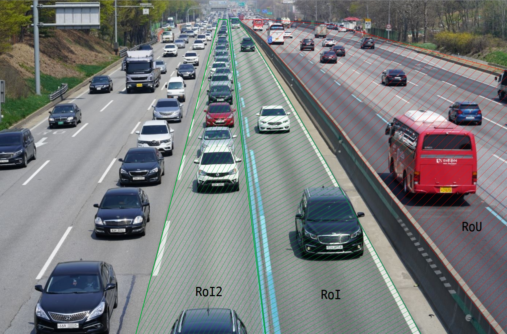
3. 최소 번호판 크기 설정 기능 추가

   - 최소 번호판 크기를 설정하면 이보다 작은 번호판 영역은 무시합니다. ([자세히](DevGuide#24-최소-번호판-크기-설정))

4. 인식률 향상
   - 알고리즘 개선으로 번호판 인식 정확도가 향상되었습니다.
5. `tscam` 모듈 분리
   - `tscam`을 `TS-ANPR` 배포에서 분리하여 [TS-CAM Releases](https://github.com/bobhyun/TS-CAM/releases)에서 배포함
   - 자체 서명 인증서를 통한 HTTPS 카메라 지원

## 딥러닝 모델별 용도

라이선스는 모든 딥러닝 모델에 공통으로 적용되며 용도에 적합한 모델을 선택하면 됩니다.

| 모델  |      처리 속도      | 적용 예                                                                                                                                                                                                                                                        |
| :---: | :-----------------: | :------------------------------------------------------------------------------------------------------------------------------------------------------------------------------------------------------------------------------------------------------------- |
| **S** | 빠름 (근거리용) | 주차장 입출관리                                                                                                                                                                                                   |
| **M** | 보통 (중거리용) | 주차면 만.공차 관리 / 주차 위치 찾기 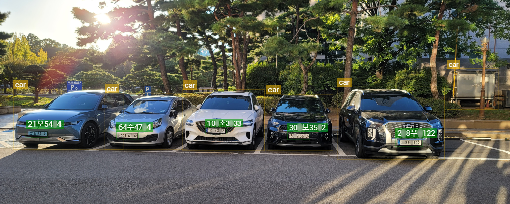 어안 렌즈 카메라 (360° 서라운드 인식) 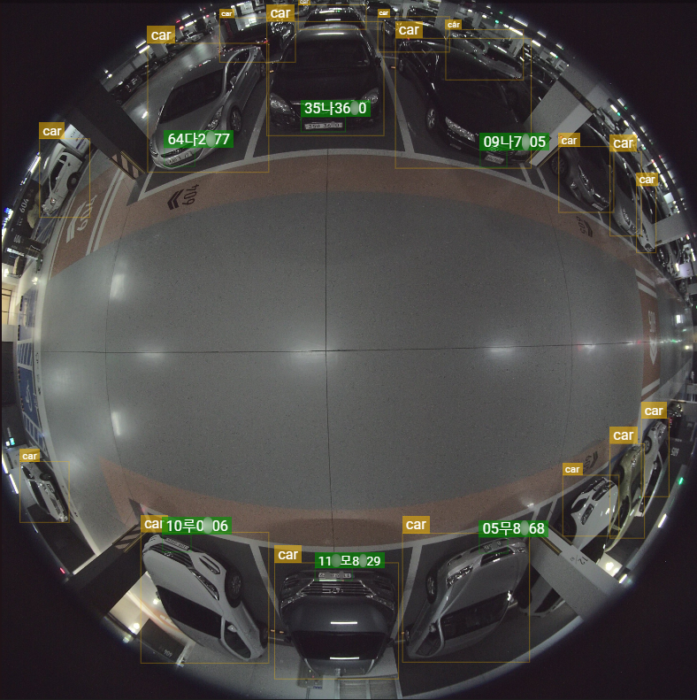 전복 차량 (360° 서라운드 인식) 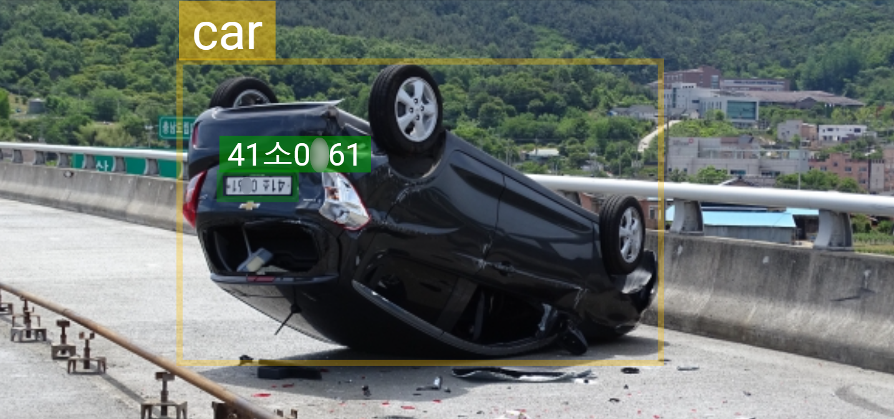 |
| **L** | 느림 (원거리용) | 대규모 야외 주차장 / 차량 대수 카운트 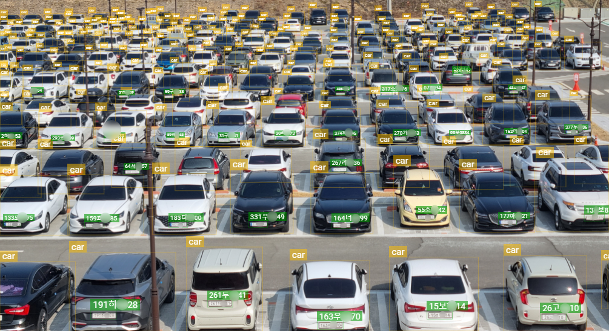 다차로 차량 번호 인식 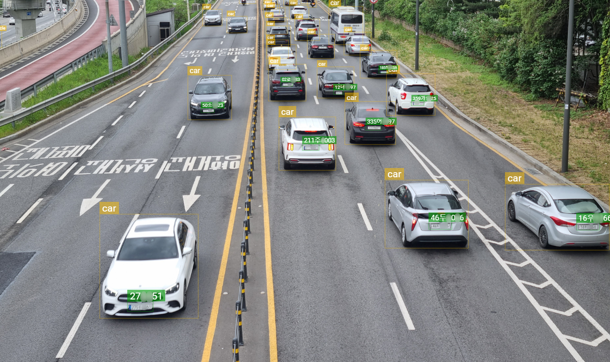 통행량 집계                                       |

## 딥러닝 모델별 인식 속도 비교표

| CPU                             | 코어 | 쓰레드 | 클럭(1) | 운영체제                          | S(2) | M(2) | L(2) |
| ------------------------------- | ---: | -----: | -----------------: | :-------------------------------- | --------------: | --------------: | --------------: |
| 인텔 i7-12700                   |   12 |     20 |                2.1 | 64비트 윈도우즈 64비트 리눅스 |           0.021 |           0.036 |           0.054 |
| 인텔 i5-6500                    |    4 |      4 |                3.2 | 64비트 윈도우즈 64비트 리눅스 |           0.031 |           0.078 |           0.140 |
| (상동)                          |      |        |                    | 32비트 윈도우즈                   |           0.078 |           0.172 |           0.296 |
| 인텔 i3-8100                    |    4 |      4 |                3.6 | 64비트 윈도우즈 64비트 리눅스 |           0.042 |           0.087 |           0.156 |
| (상동)                          |      |        |                    | 32비트 윈도우즈                   |           0.089 |           0.204 |           0.656 |
| 인텔 셀러론 J4005               |    2 |      2 |                2.0 | 64비트 윈도우즈 64비트 리눅스 |           0.396 |           0.886 |           1.563 |
| (상동)                          |      |        |                    | 32비트 윈도우즈                   |           0.629 |           1.355 |           2.368 |
| 인텔 셀러론 1037U(3) |    2 |      2 |                1.8 | 32비트 윈도우즈                   |           0.484 |           1.061 |           1.856 |
| Rockchip RK3588S(4)  |    8 |      8 |                1.5 | 64비트 리눅스                     |           0.227 |           0.462 |           0.842 |
| Broadcom BCM2711(5)  |    4 |      4 |                1.8 | 64비트 리눅스                     |           0.465 |           1.024 |           1.817 |

- 차량 한대만 있는 이미지로 측정함
- (1) 단위: GHz
- (2) 단위: 초
- (3) 32비트 전용 CPU [(제조사 사양 보기)](https://www.intel.co.kr/content/www/kr/ko/products/sku/71995/intel-celeron-processor-1037u-2m-cache-1-80-ghz/specifications.html)
- (4) NanoPi R6S [(제조사 사양 보기)](https://www.friendlyelec.com/index.php?route=product/product&product_id=289)
- (5) 라즈베리 파이4 [(제조사 사양 보기)](https://www.raspberrypi.com/products/raspberry-pi-4-model-b/)

## 특장점

#### 1. 차번 인식 성능

아래와 같은 다양한 환경 요인에 대해 뛰어난 적응력을 보입니다.

- 반사 필름 (한국 번호판)
  

    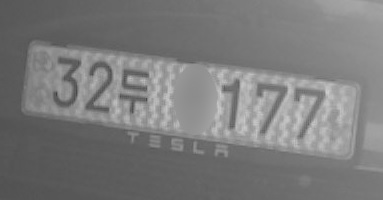
    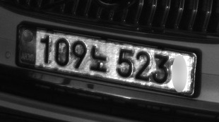
    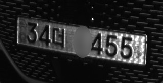
    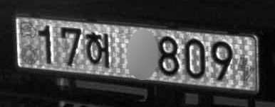
    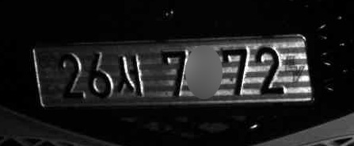
    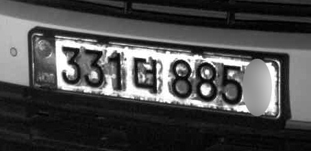
    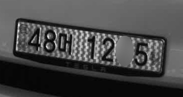
    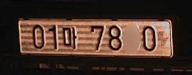
    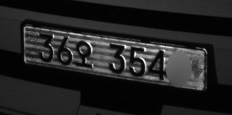
    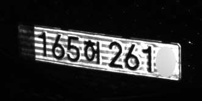
    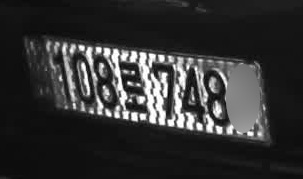
    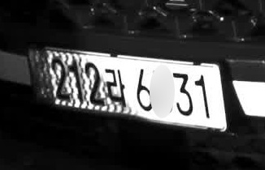
    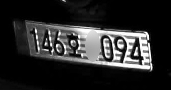
    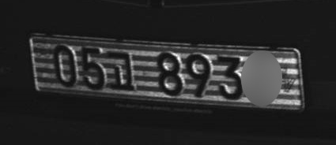
  

- 야간 노이즈
  

    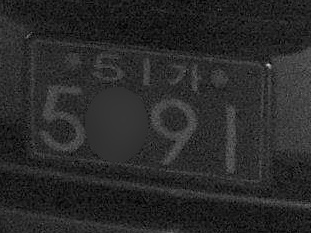
    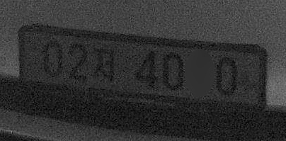
    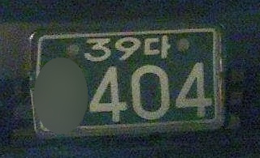
    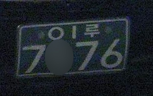
    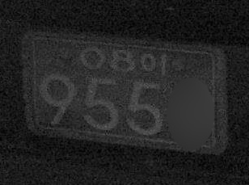
    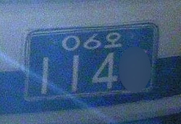
    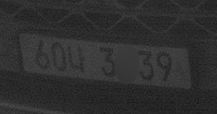
    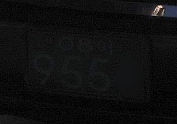
    
  

- 촬영 각도
  

    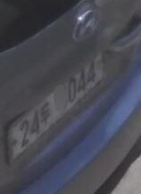
    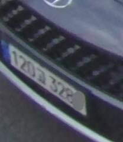
    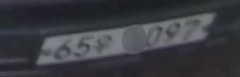
    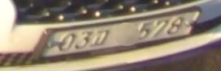
    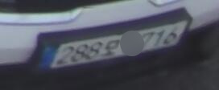
    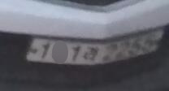
    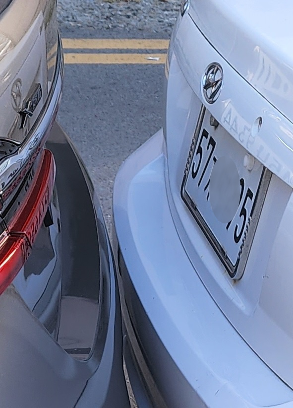
    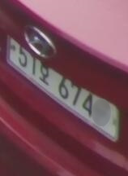
    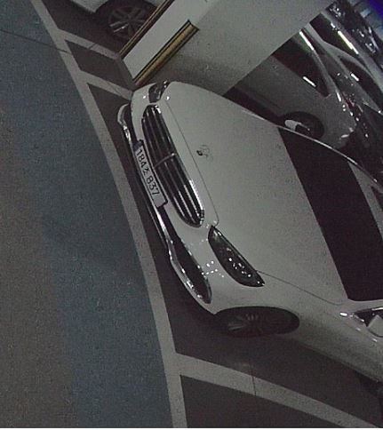
    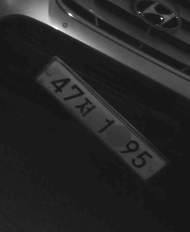
    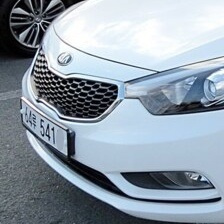
    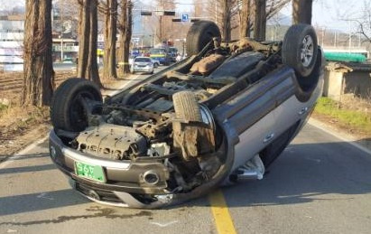
  

- 날씨 / 조명
  

    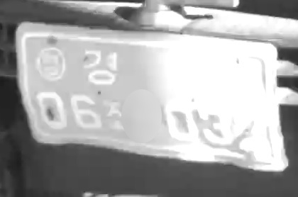
    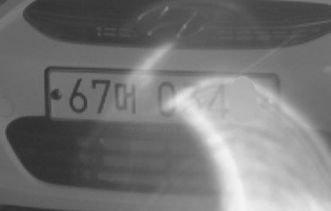
    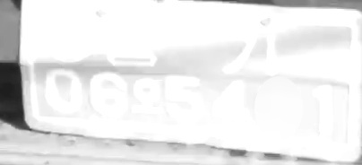
    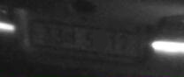
    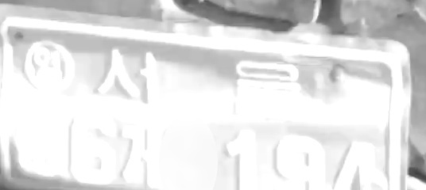
    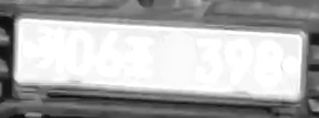
    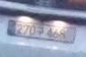
    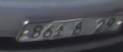
    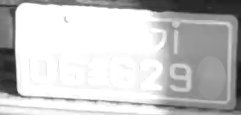
    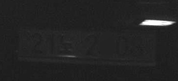
  

- 오염 / 훼손
  
    
    
    
    
    
    
    
    
    
    
    
  

- 360도 어안 카메라 이미지
  - _이미지를 펼치지 않고 원본 이미지에서 여러 대의 차량 번호를 인식합니다._
  

    
  

#### 2. 각종 번호판 규격 지원

아래와 같은 다양한 번호판 규격을 지원합니다.

- 한국 번호판

  - 덤프트럭, 중장비 번호판
    
    
      
      
      
      
      
      
    

  - 특수 번호판 (임시, 외교, 군용)
    

      
      
      
      
      
      
      
      
      
      
      
      
    

  - 친환경 전기차 번호판
    - 차번 인식 결과에 친환경 전기차 여부를 구분합니다.
    - 단, 영업용 차량 번호판처럼 번호판 규격상 내연기관 차량과 구분되지 않는 경우는 판단이 불가능합니다.
    

      
      
    

  - ’80, ’90년대 구형 번호판

    - 1996년도 번호판 규격 개정 이전에 사용되던 ‘처’, ‘퍼’, ‘차’, ‘파’, ‘추’ ~ ‘후’, ‘그’ ~ ‘흐’ 문자를 지원합니다.
    - 구형 주한미군 번호판 형식을 지원합니다.
    
    
      
      
      
      
      
    

- 일본 번호판
  - 특수 번호판 (외교, 자위대)
    
    
      
      
      
      
      
      
      
      
      
      
    

  - ’60년대 구형 번호판
    - 지역명 한 글자(예: 東, 京, 名 등)만 표기하던 구형 번호판 형식을 지원합니다.
    
    
      
      
      
      
      
    

#### 3. 주요 운영체제 / CPU 아키텍처 지원

- 윈도우즈
  - 인텔 계열 64비트(windows-x86_64), 32비트(windows-x86)
  - 윈도우즈 7 이상 호환
- 리눅스
  - 인텔 계열 64비트(linux-x86_64),
  - ARM 계열 64비트(linux-aarch64)
  - 배포판에 관계없이 glibc 2.27 이상 호환

#### 4. 다양한 개발 환경 지원

- 특정 프로그래밍 언어에 종속되지 않는 범용 라이브러리 인터페이스
  - [프로그래밍 언어별 예제 제공](../../examples/)
- [입력 이미지 파일 형식](DevGuide.md#12-anpr_read_file)
  - `bmp`, `jpg`, `png`, `pnm`, `pbm`, `pgm`, `ppm`, `jfif`, `webp`
- [입력 이미지 메모리 버퍼 픽셀 형식](DevGuide.md#13-anpr_read_pixels)
  - `GRAY`, `BGRA`, `RGBA`, `RGB`, `BGR`, `BGR555`, `BGR565`, `HSV`, `YCrCb`, `I420`, `YV12`, `IYUV`, `NV12`, `NV21`
- [인식 결과 출력 형식](DevGuide.md#3-output-formats)
  - `text`, `csv`, `json`, `yaml`, `xml`

#### 5. 다양한 라이선스 제공

- 무료 평가판 라이선스
  - 개발 및 데모용으로 시스템당 설치 이후 30일간 무료 사용 기간 제공
- 상용 라이선스
  - 매체별: USB 동글, 또는 소프트웨어 라이선스 중 선택
  - 기능 및 성능별: `Basic`, `객체인식`, `Pro`, `Server` 중 응용 소프트웨어 요구사항에 따라 선택 가능 ([참고: TS-ANPR 엔진](LICENSE.md#2-ts-anpr-엔진))

## 다양한 인식 옵션

#### 1. 차량에 장착된 번호판 검사

차체가 보이는 이미지에서 차량에 부착된 번호판인지 구분합니다.
**차량 부착(v)** 옵션을 사용하면 차량에 부착된 번호판만 인식합니다. 

아래 이미지처럼 차량없이 번호판만 있거나 바이크 번호판 등은 무시합니다. 

[이미지 출처: 연합뉴스]

</img>

 

[이미지 출처: 바이커즈랩]

</img>

 

번호판만 근접 촬영된 경우는 차량 인식이 안되는 경우가 있는데, 이런 경우 **차량 부착(v)** 옵션을 사용하지 않으면 차량 번호를 인식할 수 있습니다. 

#### 2. 다중 인식 (Multiple Recognition)

**다중 인식(m)** 옵션을 사용하면 이미지에 차량이 여러 대 있으면 모두 인식합니다. 

**다중 인식(m)** 옵션을 사용하지 않으면 여러 대 차량 중 가장 번호판 신뢰도가 높은(잘 보이는) 것 하나만 인식합니다. 

#### 3. 360° 서라운드 인식 (Surround Recognition)

**360° 서라운드 인식(s)** 옵션을 사용하면 전복된 차량 또는 어안 렌즈 카메라로 촬영한 차량 등 이미지 내의 차량이 사방으로 기울어져 있거나 넘어져 있는 경우도 차량 번호를 인식할 수 있습니다. 

[이미지 출처: KBS]

</img>

 

#### 4. 객체 인식 (Object Detection)

**객체 인식(d)** 옵션을 사용하면 이미지 내의 객체를 인식합니다.
출력된 차량 영역과 응용 프로그램에서 설정한 주차면 영역을 비교하면 만.공차 여부를 판단할 수 있습니다. 

#### 5. 객체(차량)의 차량 번호 인식 (Read License Plate)

**객체 인식(d)** 과 **차량 번호 인식(r)** 옵션을 함께 사용하면 객체 인식된 차량의 번호까지 인식합니다. 

#### 5. 관심 영역 및 최소 번호판 크기 설정

**관심 영역(i)**, **비관심 영역(x)**, **최소 번호판 크기(a)**를 조합해서 설정하여 관심 영역 밖의 차량이 번호 인식되는 경우를 방지할 수 있습니다. 

---

- 응용 프로그램 개발 전 단계의 기본적인 성능 테스트는 [라이브 데모](http://tsnvr.ipdisk.co.kr/)를 이용하실 수 있습니다.
- 응용 프로그램 개발 단계에서는 [응용 프로그램 개발 가이드](DevGuide.md) 와 포함된 프로그래밍 언어별 예제들을 참고하시기 바랍니다.
