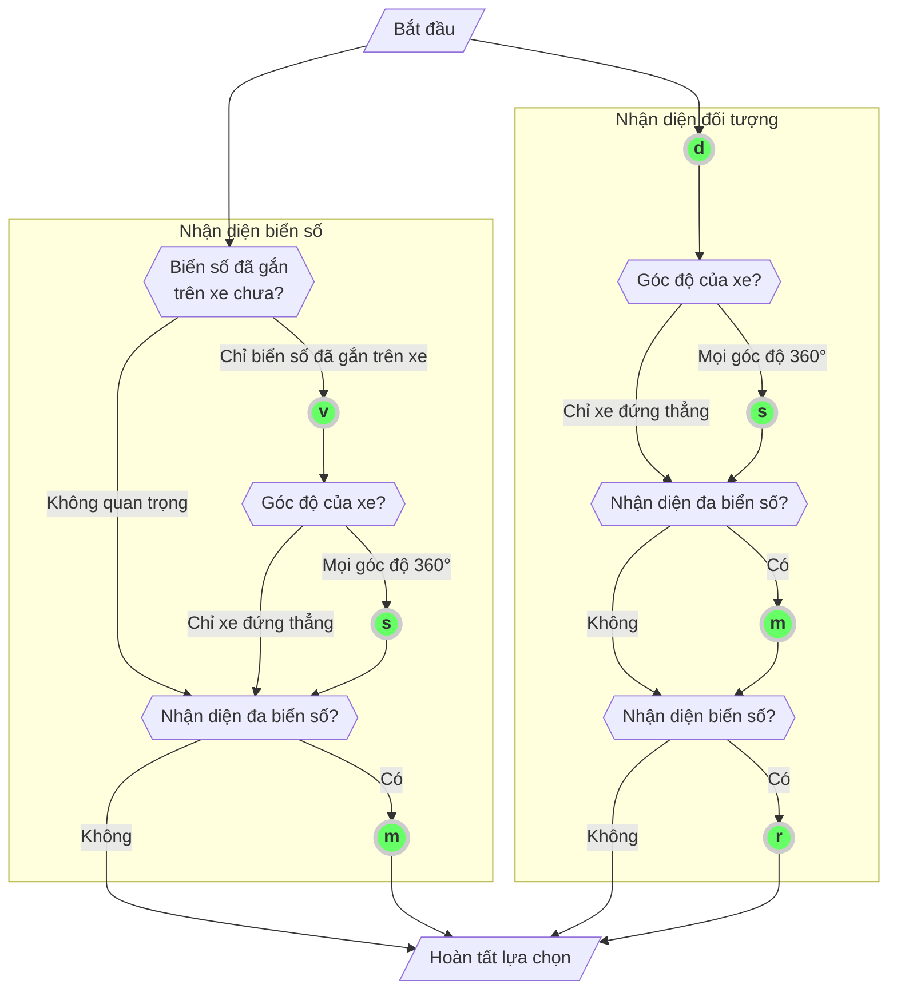

[English](../../DevGuide.md) | [日本語](../ja-JP/DevGuide.md) | [한국어](../ko-KR/DevGuide.md) | Tiếng Việt

# Hướng dẫn phát triển ứng dụng

## Mục lục

- [1. Entry Points](#1-entry-points)
  - [1.1. anpr_initialize](#11-anpr_initialize)
  - [1.2. anpr_read_file](#12-anpr_read_file)
  - [1.3. anpr_read_pixels](#13-anpr_read_pixels)
- [2. Tùy chọn nhận diện](#2-tùy-chọn-nhận-diện)
  - [2.1. Danh sách tùy chọn hỗ trợ theo loại giấy phép](#21-danh-sách-tùy-chọn-hỗ-trợ-theo-loại-giấy-phép)
  - [2.2. Hướng dẫn lựa chọn tùy chọn](#22-hướng-dẫn-lựa-chọn-tùy-chọn)
  - [2.3. Thiết lập vùng quan tâm (RoI) / Vùng không quan tâm (RoU)](#23-thiết-lập-vùng-quan-tâm-roi--vùng-không-quan-tâm-rou)
  - [2.4. Thiết lập kích thước tối thiểu của biển số](#24-thiết-lập-kích-thước-tối-thiểu-của-biển-số)
- [3. Định dạng dữ liệu xuất ra](#3-định-dạng-dữ-liệu-xuất-ra)
  - [3.1. Kết quả nhận diện biển số xe](#31-kết-quả-nhận-diện-biển-số-xe)
    - [3.1.1. text](#311-text)
    - [3.1.2. csv](#312-csv)
    - [3.1.3. json](#313-json)
    - [3.1.4. yaml](#314-yaml)
    - [3.1.5. xml](#315-xml)
  - [3.2. Kết quả nhận diện đối tượng](#32-kết-quả-nhận-diện-đối-tượng)
    - [3.2.1. csv, text](#321-csv-text)
    - [3.2.2. json](#322-json)
    - [3.2.3. yaml](#323-yaml)
    - [3.2.4. xml](#324-xml)
- [4. Bảng mã lỗi](#4-bảng-mã-lỗi)

## 1. Entry Points

Tất cả các nguyên mẫu hàm đều như sau:

```cpp
#ifdef WIN32
#define TS_ANPR_ENTRY extern "C" __declspec(dllexport) const char* WINAPI
#else
#define TS_ANPR_ENTRY extern "C" const char*
#endif
```

_Để tránh dài dòng, các phần sau đây sẽ được ký hiệu là `TS_ANPR_ENTRY`._

### 1.1. anpr_initialize

Khởi tạo thư viện.
Để sử dụng thư viện, hàm này phải được gọi một lần trước tất cả các hàm khác.

```cpp
TS_ANPR_ENTRY anpr_initialize(const char* mode); // [IN] Thiết lập chế độ hoạt động của thư viện
```

**Tham số**:

- `mode`
  - Được sử dụng để chỉ định chế độ hoạt động của thư viện (được mở rộng từ mục đích ban đầu là `outputFormat`)
  - Có thể chỉ định nhiều thiết lập bằng cách phân tách bằng dấu chấm phẩy (`;`) (ví dụ: `json;sync`)
    ```python
      # Ví dụ Python
      # nhiều cài đặt
      err = anpr_initialize(b'json;sync')
    ```
- Các mục có thể chỉ định
  - `outputFormat`:
    - Định dạng dữ liệu đầu ra
    - Các định dạng hỗ trợ: `text`, `json`, `yaml`, `xml`, `csv` _(mặc định: `text`)_
    - Có thể sử dụng trực tiếp `text`, `json` mà không cần ghi rõ `outputFormat`
  - `sync`:
    - Chạy ở chế độ đồng bộ (sử dụng khóa thread và xử lý theo thứ tự gọi)
    - Nếu ứng dụng của bạn không sử dụng thread pool cố định mà liên tục tạo mới thread, có thể xem xét sử dụng khi gặp các mã lỗi sau:
      - `103: Too many workers` Số lượng thread gọi thư viện vượt quá giới hạn (tối đa 256)
      - `104: Resource exhausted` Resource exhausted Không thể cấp phát thêm tài nguyên
    - Không cần quản lý thread bất đồng bộ phức tạp, nhưng hiệu năng xử lý song song có thể giảm do sử dụng khóa thread (lock)
    - Có thể chỉ định bằng `sync=true` hoặc `sync=false`, hoặc chỉ cần ghi `sync` (nếu không chỉ định, mặc định là `sync=false`)
      ```python
        # Ví dụ Python
        # Chạy ở chế độ đồng bộ
        err = anpr_initialize(b'sync')
      ```
  - `minChar`:
    - Chỉ định số lượng ký tự tối thiểu để nhận diện biển số thành công
    - Nếu không chỉ định hoặc giá trị là `0`, số âm hoặc không phải số, mặc định là `4`
      - Ví dụ đúng: `minChar=5` (biển số phải có ít nhất 5 ký tự để nhận diện thành công)
        ```python
          # Ví dụ Python
          # Cài đặt nhận diện số thành công khi có từ 5 ký tự trở lên
          err = anpr_initialize(b'minChar=5')
        ```
      - Ví dụ sai: `minChar=0`, `minChar=-10`, `minChar=hai ký tự` (giá trị bị bỏ qua, áp dụng mặc định là `4`)
  - `country`:
    - Chỉ định quốc gia cho mô hình nhận diện biển số xe.
      - Ví dụ sử dụng: `country=JP` (thiết lập cho biển số Nhật Bản)
    - Các mã quốc gia có sẵn:
      - `KR`: Biển số Hàn Quốc
      - `JP`: Biển số Nhật Bản
      - `VN`: Biển số Việt Nam
        ```python
        # Ví dụ Python
        # Cách chỉ định quốc gia
        err = anpr_initialize(b'country=KR')  # Biển số Hàn Quốc (mặc định)
        err = anpr_initialize(b'country=JP')  # Biển số Nhật Bản
        err = anpr_initialize(b'country=VN')  # Biển số Việt Nam
        ```
    - Với bản dùng thử miễn phí, bạn có thể chỉ định mã quốc gia trong ứng dụng, nhưng với giấy phép thương mại, quốc gia được hỗ trợ sẽ do giấy phép đã mua quyết định.
  - `symbol`: _(chỉ dành cho biển số Nhật Bản)_
    - Chỉ định cách xuất ký tự `·`, `-` trên biển số Nhật
      - `none`: Không xuất ký tự `·`, `-` (giá trị mặc định)
      - `zero`: Xuất `·` thành `0`, không xuấ `-`
      - `dot`: Xuất nguyên ký tự `·`, không xuất `-`
      - `full`: Xuất nguyên ký tự `·`, `-`
        ```python
          # Ví dụ Python
          # Xuất nguyên ký tự ·, -
          err = anpr_initialize(b'symbol=full')
        ```

**Giá trị trả về**:

- Nếu thành công, trả về chuỗi rỗng kết thúc bằng ký tự NULL(`NULL terminated string (0x00)`).
- Nếu có lỗi, trả về chuỗi thông báo lỗi theo định dạng dữ liệu được chỉ định trong `outputFormat` của `mode` (mã hóa utf-8).

### 1.2. anpr_read_file

Nhận dạng biển số xe từ tệp hình ảnh.

```cpp
TS_ANPR_ENTRY anpr_read_file(
  const char* imgFileName,  // [IN] Tên tệp hình ảnh đầu vào
  const char* outputFormat, // [IN] Định dạng dữ liệu đầu ra
  const char* options);     // [IN] Tùy chọn chức năng
```

**Tham số**:

- `imgFileName`:
  - Tên tệp hình ảnh đầu vào (mã hóa utf-8)
  - Các định dạng hình ảnh được hỗ trợ: `bmp`, `jpg`, `png`, `pnm`, `pbm`, `pgm`, `ppm`, `jfif`, `webp`
- `outputFormat`:
  - Định dạng dữ liệu đầu ra
  - Các định dạng hỗ trợ: `text`, `json`, `yaml`, `xml`, `csv` _(mặc định: `text`)_
  - Khi sử dụng tùy chọn nhận diện đối tượng, `text` sẽ được xuất ra dưới dạng `csv`.
- `options`:
  - Chỉ định các tùy chọn cho thuật toán nhận diện biển số xe.
    (Tham khảo: [2. Tùy chọn nhận diện](#2-tùy-chọn-nhận-diện))

**Giá trị trả về**:

- Trả về kết quả nhận diện biển số xe dưới dạng chuỗi theo định dạng dữ liệu được chỉ định trong `outputFormat` (mã hóa utf-8).
- Tùy theo các `options`sử dụng cho nhận diện biển số hoặc nhận diện đối tượng, định dạng của `outputFormat` sẽ được phân tách tương ứng. (Tham khảo: [3. Định dạng dữ liệu xuất ra](#3-định-dạng-dữ-liệu-xuất-ra))

  ```python
    # Ví dụ Python
    result = anpr_read_file(b'input-image.jpg', b'json', b'vms')
    if len(result) > 0:
        print(result.decode('utf8'))
  ```

**Lưu ý**:

- Bộ đệm chuỗi được sử dụng cho giá trị trả về được quản lý bên trong thư viện, ứng dụng chỉ cần tham chiếu đến bộ đệm chuỗi này.
- Bộ đệm chuỗi này an toàn với đa luồng (thread-safe) và kết quả sẽ được giữ lại cho từng luồng cho đến khi có lệnh gọi tiếp theo.
- Trang tham khảo
  - https://docs.microsoft.com/ko-kr/windows/win32/medfound/image-stride
  - https://docs.microsoft.com/ko-kr/windows/win32/medfound/video-fourccs

### 1.3. anpr_read_pixels

Nhận diện biển số xe từ bộ nhớ đệm (buffer) hình ảnh đã tải vào.
Từ phiên bản `TS-ANPR v2.3.0`, hỗ trợ cả hình ảnh đã được mã hóa.

```cpp
TS_ANPR_ENTRY anpr_read_pixels(
  const unsigned char* pixels,  // [IN] Địa chỉ bắt đầu của pixel hình ảnh
  const unsigned long width,    // [IN] Số pixel chiều rộng của hình ảnh
  const unsigned long height,   // [IN] Số pixel chiều cao của hình ảnh
  const long stride,            // [IN] Số byte trên một dòng hình ảnh
  const char* pixelFormat,      // [IN] Định dạng pixel của hình ảnh
  const char* outputFormat,     // [IN] Định dạng dữ liệu đầu ra
  const char* options);         // [IN] Tùy chọn chức năng
```

**Tham số**:

- `pixels`:
  - Địa chỉ bắt đầu của pixel hình ảnh
- `width`:
  - Số pixel chiều rộng của hình ảnh
  - Nếu là hình ảnh đã mã hóa, đây là tổng số byte của hình ảnh
- `height`:
  - Số pixel chiều cao của hình ảnh
  - Nếu là hình ảnh đã mã hóa, không sử dụng (mặc định đặt là `0`)
- `stride`:
  - Số byte trên một dòng hình ảnh (nếu là `0`sẽ tự động tính toán, giả định không có padding)
  - Nếu là hình ảnh đã mã hóa, không sử dụng (mặc định đặt là `0`)
- `pixelFormat`:
  - Định dạng pixel của hình ảnh
  - Các định dạng pixel hỗ trợ:
    - `GRAY`: 흑백 이미지 (8bpp)
    - `BGRA`: BGRA (32bpp)
    - `RGBA`: RGBA (32bpp)
    - `RGB`: RGB (24bpp)
    - `BGR`: BGR (24bpp)
    - `BGR555`: BGR (16bpp)
    - `BGR565`: BGR (16bpp)
    - `HSV`: HSV (32bpp)
    - `YCrCb`: YUV444 (32bpp)
    - `I420`: YUV420 (12bpp)
    - `YV12`: YUV420 (12bpp)
    - `IYUV`: YUV420 (12bpp)
    - `NV12`: YUV420 (12bpp)
    - `NV21`: YUV420 (12bpp)
  - Các định dạng hình ảnh mã hóa hỗ trợ:
    - `bmp`, `jpg`, `jpeg`, `png`, `pnm`, `pbm`, `pgm`, `ppm`, `jfif`, `webp`
    - Nếu chỉ định là `encoded`, định dạng hình ảnh sẽ tự động nhận diện
- `outputFormat`: _(giống như `anpr_read_file`)_
- `options`: _(giống như `anpr_read_file`)_

**Giá trị trả về**: _(giống như `anpr_read_file`)_
**Lưu ý**: _(giống như `anpr_read_file`)_

```python
  # Ví dụ Python

  # Nhập khung hình video
  ret, frame = capture.read()
  height = frame.shape[0]
  width = frame.shape[1]
  result = anpr_read_pixels(bytes(frame), width, height, 0, b'BGR', b'json', b'vms')
  if len(result) > 0:
      print(result.decode('utf8'))

  # Nhập hình ảnh từ trang web
  response = requests.get('https://example.com/image.jpg')
  if response.status_code == 200:
      result = anpr_read_pixels(response.content, 0, 0, 0, b'encoded', b'json', b'vms')
      if len(result) > 0:
          print(result.decode('utf8'))
```

## 2. Tùy chọn nhận diện

- Có thể chỉ định nhiều tùy chọn khác nhau để điều chỉnh thuật toán nhận diện biển số xe phù hợp với môi trường sử dụng.

### 2.1. Danh sách tùy chọn hỗ trợ theo loại giấy phép

| Ký tự | Ý nghĩa                                                         | Giấy phép áp dụng                      |
| ----- | --------------------------------------------------------------- | -------------------------------------- |
| `v`   | Xác định biển số đã gắn trên xe hay chưa                        | Tất cả                                 |
| `b`   | Nhận diện một trong các biển số đã gắn trên xe                  | Tất cả                                 |
| `m`   | Nhận diện tất cả biển số xe của nhiều xe (nhận diện đa biển số) | `Nhận diện đối tượng`, `Pro`, `Server` |
| `s`   | Nhận diện biển số ở mọi góc độ 360° của xe (nhận diện surround) | `Nhận diện đối tượng`, `Pro`, `Server` |
| `d`   | Nhận diện đối tượng (phân biệt xe tải/trống)                    | Tất cả                                 |
| `r`   | Nhận diện biển số của đối tượng (xe) đã nhận diện               | Tất cả                                 |
| `i`   | Thiết lập vùng quan tâm (RoI)                                   | Tất cả                                 |
| `x`   | Thiết lập vùng không quan tâm (RoU)                             | Tất cả                                 |
| `a`   | Thiết lập kích thước tối thiểu của biển số xe                   | Tất cả                                 |

- Tùy theo loại giấy phép, số lượng xe nhận diện được và các chức năng sẽ khác nhau. (Tham khảo: [Động cơ TS-ANPR](LICENSE.md#2-Động-cơ-TS-ANPR))

### 2.2. Hướng dẫn lựa chọn tùy chọn

rên sơ đồ luồng bên dưới, khi di chuyển từ `Bắt đầu` đến `Hoàn tất lựa chọn`, hãy gom các ký tự trong các vòng tròn màu xanh lá mà bạn đã đi qua để sử dụng làm giá trị tùy chọn. (Thứ tự các ký tự không quan trọng.)
Ví dụ: Nếu đường đi là `Bắt đầu` → `v` → `s` → `m` → `Hoàn tất lựa chọn`, giá trị tùy chọn sẽ là `"vsm"`.



- Ví dụ sử dụng tùy chọn nhận diện biển số
  | options | Ý nghĩa
  |---------|------------------------------------------------------------
  | | Nhận diện một trong tất cả các biển số
  | `v` | Nhận diện một trong các biển số đã gắn trên xe
  | `b` | Nhận diện một biển số được gắn trên xe máy (Chỉ áp dụng cho biển số Việt Nam)
  | `m` | Nhận diện đa biển số (tất cả các biển số)
  | `vm` | Nhận diện đa biển số đã gắn trên xe
  | `vs` | Nhận diện một biển số đã gắn trên xe, mọi góc độ 360°
  | `vsm` | Nhận diện đa biển số đã gắn trên xe, mọi góc độ 360°

- Ví dụ sử dụng tùy chọn nhận diện đối tượng
  | options | Ý nghĩa
  |---------|------------------------------------------------------------
  | `d` | Nhận diện một đối tượng (không nhận diện biển số xe)
  | `dr` | Nhận diện một đối tượng, nhận diện biển số xe
  | `ds` | Nhận diện một đối tượng, mọi góc độ 360° (không nhận diện biển số xe)
  | `dsr` | Nhận diện một đối tượng, mọi góc độ 360°, nhận diện biển số xe
  | `dm` | Nhận diện đa đối tượng (không nhận diện biển số xe)
  | `dmr` | Nhận diện đa đối tượng, nhận diện biển số xe
  | `dms` | Nhận diện đa đối tượng, mọi góc độ 360° (không nhận diện biển số xe)
  | `dmsr` | Nhận diện đa đối tượng, mọi góc độ 360°, nhận diện biển số xe

### 2.3. Thiết lập vùng quan tâm (RoI) / Vùng không quan tâm (RoU)


#### Vùng quan tâm(RoI)

- Vùng quan tâm được biểu diễn bằng một vùng đa giác nối các tọa độ pixel của từng đỉnh.
  - Sau ký tự `i`, liệt kê tọa độ pixel của từng đỉnh theo thứ tự x, y, cách nhau bằng dấu phẩy.
- Có thể thiết lập nhiều vùng quan tâm và có thể kết hợp với các tùy chọn nhận diện biển số khác.

#### Vùng không quan tâm(RoU)

- Vùng không quan tâm được biểu diễn bằng một vùng đa giác nối các tọa độ pixel của từng đỉnh.
  - Sau ký tự `x`, liệt kê tọa độ pixel của từng đỉnh theo thứ tự x, y, cách nhau bằng dấu phẩy.
- Có thể thiết lập nhiều vùng không quan tâm và có thể kết hợp với các tùy chọn nhận diện biển số khác.

**[Lưu ý]** Nếu không chỉ định vùng quan tâm hoặc vùng không quan tâm, hệ thống sẽ nhận diện biển số trên toàn bộ hình ảnh.
Nếu chỉ định cả vùng quan tâm và vùng không quan tâm, các khu vực bị chồng lấp sẽ ưu tiên vùng không quan tâm. Do đó, tất cả biển số xe nằm trong vùng chồng lấp sẽ bị bỏ qua.

```python
# Ví dụ Python
# Khi tọa độ pixel của từng đỉnh đa giác cho mỗi vùng trên ảnh như sau:
# RoI = [(810,64), (939,1182), (1486,1182), (1149,571), (879,124), (839,64)]
# RoI2 = [(771,67), (479,1182), (1793,1182), (801,67)]
# RoU = [(851,70), (923,134), (1753,1182), (1789,1182), (1789,250), (1176,87), (946,68)]

# Thiết lập một vùng quan tâm (RoI)
result = anpr_read_file(
  b'roi.jpg',    # Tên tệp đầu vào
  b'text',       # Định dạng đầu ra
  b'vi810,64,939,1182,1486,1182,1149,571,879,124,839,64') # Sử dụng tùy chọn 'v' để chỉ nhận diện biển số gắn trên xe

# Thiết lập hai vùng quan tâm (RoI)
result = anpr_read_file(
  b'roi.jpg',    # Tên tệp đầu vào
  b'text',       # Định dạng đầu ra
  b'vi810,64,939,1182,1486,1182,1149,571,879,124,839,64i771,67,479,1182,1793,1182,801,67')

# Thiết lập một vùng quan tâm và một vùng không quan tâm (RoU)
result = anpr_read_file(
  b'roi.jpg',    # Tên tệp đầu vào
  b'text',       # Định dạng đầu ra
  b'vi810,64,939,1182,1486,1182,1149,571,879,124,839,64x851,70,923,134,1753,1182,1789,1182,1789,250,1176,87,946,68')

# Thiết lập một vùng không quan tâm (RoU)
result = anpr_read_file(
  b'roi.jpg',    # Tên tệp đầu vào
  b'text',       # Định dạng đầu ra
  b'vx851,70,923,134,1753,1182,1789,1182,1789,250,1176,87,946,68')
```

### 2.4. Thiết lập kích thước tối thiểu của biển số

- Kích thước tối thiểu của biển số được chỉ định bằng diện tích của hộp giới hạn biển số (chiều rộng x chiều cao tính bằng pixel), sau ký tự `a`.
  Ví dụ, nếu chiều rộng là `100` pixel và chiều cao là `40` pixel, thì sẽ ghi là `a4000`.
- Khi thiết lập kích thước tối thiểu, các biển số nhỏ hơn kích thước này sẽ bị bỏ qua.

  ```python
  # Ví dụ bằng Python
  # Kích thước biển số trong hình là 156 x 154 = 24024
  result = anpr_read_file(
    b'test.jpg',  # Tên tệp đầu vào
    b'text',      # Định dạng đầu ra
    b'vi7,580, 829,293, 1910,325, 1798,1077, 0,1077a24024')  # Thiết lập vùng quan tâm và kích thước tối thiểu của biển số
  ```

## 3. Định dạng dữ liệu xuất ra

Dữ liệu đầu ra được chia thành hai định dạng:

- Nhận diện đối tượng (khi `options` có chứa `d`)
- Nhận diện biển số xe (khi `options` không chứa `d`)

### 3.1. Kết quả nhận diện biển số xe

### 3.1.1. `text`

Chỉ xuất ra văn bản biển số xe.
Nếu có nhiều biển số, các biển số sẽ được phân tách bằng ký tự xuống dòng `CR (0x0d)`.

```text
29A02240
43HC00041
```

Nếu không nhận diện được biển số nào, sẽ xuất ra chuỗi rỗng kết thúc bằng ký tự NULL (`NULL terminated string (0x00)`).

Nếu có lỗi, sẽ xuất ra thông báo lỗi theo định dạng văn bản như dưới đây:

```text
error: (1) Invalid parameters
```

##### 3.1.2. `csv`

Xuất biển số xe và các thuộc tính dưới dạng `csv`.
Mỗi dòng tương ứng với một biển số xe được nhận diện, các cột được phân tách bằng dấu phẩy (`,`).

```csv
29A02240,1217,2083,92,175,12.45,0.75,0.83,0.20,ev
43HC00041,1108,1317,67,217,12.45,0.76,0.89,0.10,
```

Ý nghĩa của từng cột như sau:
| Cột | Ý nghĩa | Ghi chú
|-----:|---------------------------|------------------------
| 1 | Biển số xe | `text`
| 2 | Tọa độ x góc trên bên trái biển số | `area.x`
| 3 | Tọa độ y góc trên bên trái biển số | `area.y`
| 4 | Chiều rộng biển số | `area.width`
| 5 | Chiều cao biển số | `area.height`
| 6 | Góc của biển số | `area.angle`
| 7 | Độ tin cậy nhận diện ký tự | `conf.ocr`
| 8 | Độ tin cậy nhận diện biển số | `conf.plate`
| 9 | Thời gian nhận diện ký tự (giây) | `elapsed`
| 10<sup>(1)</sup> | Có phải xe điện thân thiện môi trường | `attr.ev`

- <sup>(1)</sup> (Chỉ dành cho biển số Hàn Quốc) Nếu là xe điện thân thiện môi trường, sẽ xuất `ev`, nếu không thì để trống.

Nếu không nhận diện được biển số nào, sẽ xuất ra chuỗi rỗng kết thúc bằng ký tự NULL (`NULL terminated string (0x00)`).

Nếu có lỗi, sẽ xuất ra thông báo lỗi theo định dạng sau:

```csv
error,1,Invalid parameters
```

### 3.1.3. `json`

Xuất biển số xe và các thuộc tính dưới dạng `json`.

```jsx
[
  {
    // Biển số đầu tiên
    text: "29A02240", // Biển số xe
    area: {
      // Vùng biển số (đơn vị pixel)
      x: 1217, // Tọa độ x góc trên bên trái
      y: 2083, // Tọa độ y góc trên bên trái
      width: 92, // Chiều rộng
      height: 175, // Chiều cao
      angle: 12.45, // Góc nghiêng (độ)
    },
    attrs: {
      // Thuộc tính biển số
      ev: true, // Có phải xe điện thân thiện môi trường không
    },
    ev: true, // đã ngưng dùng (đã chuyển sang attrs.ev, sẽ bị xóa ở phiên bản sau)
    conf: {
      // Độ tin cậy (giá trị từ 0 đến 1)
      ocr: 0.75, // Độ tin cậy nhận diện ký tự
      plate: 0.84, // Độ tin cậy nhận diện biển số
    },
    elapsed: 0.27, // Thời gian xử lý (đơn vị giây)
  },
  {
    // Biển số thứ hai
    text: "43HC00041",
    area: {
      x: 1108,
      y: 1317,
      width: 67,
      height: 217,
      angle: 12.45,
    },
    attrs: {
      ev: false,
    },
    ev: false,
    conf: {
      ocr: 0.76,
      plate: 0.89,
    },
    elapsed: 0.14,
  },
];
```

Nếu không nhận diện được biển số nào, sẽ xuất dữ liệu rỗng như sau:

```jsx
[];
```

Nếu có lỗi, sẽ xuất ra dưới dạng `json` như sau:

```jsx
{
  "error": {
    "code": 1,
    "message": "Invalid parameters"
  }
}
```

### 3.1.4. `yaml`

Xuất biển số xe và các thuộc tính dưới dạng `yaml`.

```yaml
- text: 29A02240 # Biển số đầu tiên, biển số xe
  area: # Vùng biển số (đơn vị pixel)
    x: 1217 # Tọa độ x góc trên bên trái
    y: 2083 # Tọa độ y góc trên bên trái
    width: 92 # Chiều rộng
    height: 175 # Chiều cao
    angle: 12.45 # Góc nghiêng (độ)
  conf: # Độ tin cậy (giá trị từ 0 ~ 1)
    ocr: 0.75 # Độ tin cậy nhận diện ký tự
    plate: 0.83 # Độ tin cậy nhận diện biển số
  attrs: # Thuộc tính biển số
    ev: true # Có phải xe điện thân thiện môi trường không
  ev: true # đã ngưng dùng (đã chuyển sang attrs.ev, sẽ bị xóa ở phiên bản sau)
  elapsed: 0.20 # Thời gian xử lý (giây)
- text: 43HC00041 # Biển số thứ hai
  area:
    x: 1108
    y: 1317
    width: 67
    height: 217
    angle: 12.45
  conf:
    ocr: 0.76
    plate: 0.89
  ev: false
  elapsed: 0.10
```

Nếu không nhận diện được biển số nào, sẽ xuất dữ liệu rỗng như sau:

```yaml

```

Nếu có lỗi, sẽ xuất ra dưới dạng `yaml` như sau:

```yaml
error
  code: 1
  message: Invalid parameters
```

### 3.1.5. `xml`

Xuất biển số xe và các thuộc tính dưới dạng `xml`.

```xml
<?xml version="1.0" encoding="utf-8"?>
<data>
  <!-- Biển số đầu tiên
    text: Biển số xe
    ev: đã ngưng dùng (đã chuyển sang attrs.ev, sẽ bị xóa ở phiên bản sau)
    elapsed: Thời gian xử lý (giây)
  -->
  <license-plate text="29A02240" ev="true" elapsed="0.20">
    <!-- Thuộc tính biển số
      ev: Có phải xe điện thân thiện môi trường không
    -->
    <attrs ev="true"/>
    <!-- Vùng biển số (đơn vị pixel)
      x: Tọa độ x góc trên bên trái
      y: Tọa độ y góc trên bên trái
      width: Chiều rộng
      height: Chiều cao
      angle: Góc nghiêng (độ)
    -->
    <area x="1217" y="2083" width="92" height="175" angle="12.45"/>
    <!-- Độ tin cậy (giá trị từ 0 ~ 1)
      ocr: Độ tin cậy nhận diện ký tự
      plate: Độ tin cậy nhận diện biển số
    -->
    <conf ocr="0.75" plate="0.83"/>
  </license-plate>
  <!-- Biển số thứ hai -->
  <license-plate text="43HC00041" ev="false" elapsed="0.11">
    <attrs ev="false"/>
    <area x="1108" y="1317" width="67" height="217"/>
    <conf ocr="0.76" plate="0.89"/>
  </license-plate>
</data>
```

Nếu không nhận diện được biển số nào, sẽ xuất dữ liệu rỗng như sau:

```xml
<?xml version="1.0" encoding="utf-8"?>
<data />
```

Nếu có lỗi, sẽ xuất ra dưới dạng `xml` như sau:

```xml
<?xml version="1.0" encoding="utf-8"?>
<error code="1" message="Invalid parameters" />
```

#### 3.2. Kết quả nhận diện đối tượng

Tìm kiếm các đối tượng đã được huấn luyện trước trong hình ảnh.
Điểm nổi bật là có thể nhận diện các đối tượng bị biến dạng trong ảnh gốc chụp bằng camera mắt cá 360°.
Hiện tại, các đối tượng được hỗ trợ như sau:
| class | Tên tiếng Việt  
|--------------|----------------------------------
| `car` | Xe ô tô
| `motorcycle` | Xe máy

##### 3.2.1. `csv`, `text`

Kết quả nhận diện đối tượng được xuất dưới dạng văn bản `cvs`.
Ngay cả khi chọn định dạng đầu ra là `text`, kết quả cũng sẽ được xuất dưới dạng `csv`.

Mỗi dòng tương ứng với một đối tượng được nhận diện, các cột được phân tách bằng dấu phẩy (`,`).

```csv
car,2171,2281,396,521,0.9679,0.2886,72TD00310,2420,2295,110,81,147.5933,0.9005,0.7864,0.3913,ev
car,264,2266,433,543,0.9706,0.2886,59UA02181,315,2281,103,81,211.3135,0.9160,0.8299,0.4189,
car,777,0,579,403,0.9716,0.2886 // Trường hợp không có thông tin biển số
```

Ý nghĩa của từng cột như sau:
| Cột | Ý nghĩa | Ghi chú
|-----:|-----------------------------------|------------------------
| 1 | Loại đối tượng | `class`
| 2 | Tọa độ x góc trên bên trái đối tượng | `area.x`
| 3 | Tọa độ y góc trên bên trái đối tượng | `area.y`
| 4 | Chiều rộng | `area.width`
| 5 | Chiều cao | `area.height`
| 6 | Độ tin cậy | `conf`
| 7 | Thời gian xử lý (giây) | `elapsed`
| 8<sup>(1)</sup> | Biển số xe | `licensePlate.text`
| 9 | Tọa độ x góc trên bên trái | `licensePlate.area.x`
| 10 | Tọa độ y góc trên bên trái | `licensePlate.area.y`
| 11 | Chiều rộng biển số | `licensePlate.area.width`
| 12 | Chiều cao biển số | `licensePlate.area.height`
| 13 | Góc của biển số | `licensePlate.area.angle`
| 14 | Độ tin cậy nhận diện ký tự | `licensePlate.conf.ocr`
| 15 | Độ tin cậy nhận diện biển số | `licensePlate.conf.plate`
| 16 | Thời gian nhận diện ký tự (giây) | `licensePlate.elapsed`
| 17<sup>(2)</sup> | Có phải xe điện thân thiện môi trường | `licensePlate.attrs.ev`

- <sup>(1)</sup> Từ cột số 8 trở đi chỉ xuất hiện khi sử dụng tùy chọn `r` và có nhận diện được biển số xe, nếu không thì các cột sau sẽ bị bỏ qua.
- <sup>(2)</sup> (Chỉ dành cho biển số Hàn Quốc) Cột số 17 sẽ xuất `ev` nếu nhận diện là xe điện thân thiện môi trường, nếu không thì để trống.

Nếu không nhận diện được đối tượng nào, sẽ xuất ra chuỗi rỗng kết thúc bằng ký tự NULL (`NULL terminated string (0x00)`).

Nếu có lỗi, sẽ xuất ra thông báo lỗi theo định dạng sau:

```csv
error,1,Invalid parameters
```

##### 3.2.2. `json`

Kết quả nhận diện đối tượng được xuất dưới dạng `json`.

```jsx
 [
  {                           // Đối tượng đầu tiên
    "class": "car",           // Loại đối tượng
    "area": {                 // Vùng đối tượng (đơn vị pixel)
      "x": 2171,              // Tọa độ x góc trên bên trái
      "y": 2281,              // Tọa độ y góc trên bên trái
      "width": 396,           // Chiều rộng
      "height": 521           // Chiều cao
    },
    "conf": 0.9679,           // Độ tin cậy nhận diện đối tượng (giá trị từ 0 ~ 1)
    "elapsed": 0.2513,        // Thời gian xử lý (giây)
    "licensePlate": [         // Biển số xe
      {
        "text": "72TD00310"    // Biển số xe
        "area": {             // Vùng biển số (đơn vị pixel)
          "x": 2420,          // Tọa độ x góc trên bên trái
          "y": 2295           // Tọa độ y góc trên bên trái
          "width": 110,       // Chiều rộng
          "height": 81,       // Chiều cao
          "angle": 147.5933   // Góc nghiêng (độ)
        },
        "attrs": {            // Thuộc tính biển số
          "ev": true          // Có phải xe điện thân thiện môi trường không
        },
        "conf": {             // Độ tin cậy (giá trị từ 0 ~ 1)
          "ocr": 0.9005,      // Độ tin cậy nhận diện ký tự
          "plate": 0.7864     // Độ tin cậy nhận diện biển số
        },
        "elapsed": 0.3525,    // Thời gian xử lý (giây)
      }
    ]
  },
  {                           // Đối tượng thứ hai
    "class": "car",
    "area": {
      "x": 264,
      "y": 2266,
      "width": 433,
      "height": 543
    },
    "conf": 0.9706,
    "elapsed": 0.2513,
    "licensePlate": [
      {
        "text": "59UA02181"
        "area": {
          "x": 315,
          "y": 2281,
          "width": 103,
          "height": 81,
          "angle": 211.3135
        },
        "attrs": {
          "ev": false
        },
        "conf": {
          "ocr": 0.916,
          "plate": 0.8299
        },
        "elapsed": 0.4402
      }
    ]
  },
  {                           // Đối tượng thứ ba (không có thông tin biển số)
    "class": "car",
    "area": {
      "x": 777,
      "y": 0
      "height": 403,
      "width": 579,
    },
    "conf": 0.9716,
    "elapsed": 0.2513
  }
]
```

Nếu không nhận diện được đối tượng nào, sẽ xuất dữ liệu rỗng như sau:

```jsx
[];
```

Nếu có lỗi, sẽ xuất ra dưới dạng `json` như sau:

```jsx
{
  "error": {
    "code": 1,
    "message": "Invalid parameters"
  }
}
```

##### 3.2.3. `yaml`

Kết quả nhận diện đối tượng được xuất dưới dạng `yaml`.

```yaml
- class: car # Đối tượng đầu tiên, loại đối tượng
  area: # Vùng đối tượng (đơn vị pixel)
    x: 2171 # Tọa độ x góc trên bên trái
    y: 2281 # Tọa độ y góc trên bên trái
    width: 396 # Chiều rộng
    height: 521 # Chiều cao
  conf: 0.9678 # Độ tin cậy nhận diện đối tượng (giá trị từ 0 ~ 1)
  elapsed: 0.3190 # Thời gian xử lý (giây)
  licensePlate: # Biển số xe
    - text: 72TD00310 # Biển số xe
      area: # ùng biển số (đơn vị pixel)
        x: 2420 # Tọa độ x góc trên bên trái
        y: 2295 # Tọa độ y góc trên bên trái
        width: 110 # Chiều rộng
        height: 81 # Chiều cao
        angle: 147.5933 # Góc nghiêng (độ)
      attrs: # Thuộc tính biển số
        ev: true # Có phải xe điện thân thiện môi trường không
      conf: # Độ tin cậy (giá trị từ 0 ~ 1)
        ocr: 0.9005 # Độ tin cậy nhận diện ký tự
        plate: 0.7864 # Độ tin cậy nhận diện biển số
      elapsed: 0.3226 # Thời gian xử lý (giây)
- class: car # Đối tượng thứ hai
  area:
    x: 264
    y: 2266
    width: 433
    height: 543
  conf: 0.9706
  elapsed: 0.3191
  licensePlate:
    - text: 59UA02181
      area:
        x: 315
        y: 2281
        width: 103
        height: 81
        angle: 211.3135
      conf:
        ocr: 0.916
        plate: 0.8299
      attrs:
        ev: false
      elapsed: 0.5527
- class: car # Đối tượng thứ ba (không có thông tin biển số)
  area:
    x: 777
    y: 0
    width: 579
    height: 403
  conf: 0.9716
  elapsed: 0.3191
```

Nếu không nhận diện được đối tượng nào, sẽ xuất dữ liệu rỗng như sau:

```yaml

```

Nếu có lỗi, sẽ xuất ra dưới dạng `yaml` như sau:

```yaml
error
  code: 1
  message: Invalid parameters
```

##### 3.2.4. `xml`

Kết quả nhận diện đối tượng được xuất dưới dạng `xml`.

```xml
<?xml version="1.0" encoding="utf-8"?>
<data>
  <!-- Đối tượng đầu tiên
    class: Loại đối tượng
    conf: Độ tin cậy nhận diện đối tượng (giá trị từ 0 ~ 1)
    elapsed: Thời gian xử lý (giây)
  -->
  <object class="car" conf="0.9679" elapsed="0.3287">
    <!-- Vùng đối tượng (đơn vị pixel)
      x: Tọa độ x góc trên bên trái
      y: Tọa độ y góc trên bên trái
      width: Chiều rộng
      height: Chiều cao
    -->
    <area x="2171" y="2281" width="396" height="521"/>

    <!-- Biển số xe
      text: Biển số xe
      elapsed: Thời gian xử lý (giây)
    -->
    <license-plate text="72TD00310" elapsed="0.3961">

      <!-- Thuộc tính biển số
        ev: Có phải xe điện thân thiện môi trường không
      -->
      <attrs ev="true"/>

      <!-- Vùng biển số (đơn vị pixel)
        x: Tọa độ x góc trên bên trái
        y: Tọa độ y góc trên bên trái
        width: Chiều rộng
        height: Chiều cao
        angle: Góc nghiêng (độ)
      -->
      <area x="2420" y="2295" width="110" height="81" angle="147.5933"/>

      <!-- Độ tin cậy (giá trị từ 0 ~ 1)
        ocr: Độ tin cậy nhận diện ký tự
        plate: Độ tin cậy nhận diện biển số
      -->
      <conf ocr="0.9005" plate="0.7864"/>
    </license-plate>
  </object>

  <!-- Đối tượng thứ hai -->
  <object class="car" conf="0.9706" elapsed="0.3287">
    <area x="264" y="2266" width="433" height="543"/>
    <license-plate text="59UA02181" elapsed="0.4364">
      <attrs ev="false"/>
      <area x="315" y="2281" width="103" height="81" angle="211.3135"/>
      <conf ocr="0.9160" plate="0.8299"/>
    </license-plate>
  </object>

  <!-- Đối tượng thứ ba (không có thông tin biển số) -->
  <object class="car" conf="0.9716" elapsed="0.3287">
    <area x="777" y="0" width="579" height="403"/>
  </object>
</data>
```

Nếu không nhận diện được đối tượng nào, sẽ xuất dữ liệu rỗng như sau:

```xml
<?xml version="1.0" encoding="utf-8"?>
<data />
```

Nếu có lỗi, sẽ xuất ra dưới dạng `xml` như sau:

```xml
<?xml version="1.0" encoding="utf-8"?>
<error code="1" message="Invalid parameters" />
```

## 4. Bảng mã lỗi

Toàn bộ danh sách lỗi được thể hiện trong bảng dưới đây.

|  code | message                    | Giải thích                                                                                       |
| ----: | -------------------------- | ------------------------------------------------------------------------------------------------ |
|   `1` | `Invalid parameters`       | Trường hợp tham số gọi hàm không hợp lệ                                                          |
|   `2` | `File not found`           | Trường hợp không tìm thấy tệp hình ảnh đầu vào                                                   |
|   `3` | `Invalid image`            | Trường hợp bộ nhớ hình ảnh đầu vào không đúng định dạng                                          |
|   `4` | `Unsupported image format` | Trường hợp hình ảnh đầu vào có định dạng không được hỗ trợ                                       |
| `100` | `License expired`          | Trường hợp giấy phép (license) đã hết hạn                                                        |
| `101` | `Corrupted library`        | Trường hợp một số tệp cấu hình thư viện bị thiếu hoặc bị hỏng                                    |
| `102` | `Not initialized`          | Trạng thái chưa khởi tạo engine                                                                  |
| `103` | `Too many workers`         | Số luồng gọi thư viện vượt quá giới hạn (tối đa 256)                                             |
| `104` | `Resource exhausted`       | Trường hợp không thể cấp phát thêm tài nguyên                                                    |
| `105` | `License not installed`    | Trạng thái chưa cài đặt giấy phép (xảy ra khi chưa cài đặt license dùng thử miễn phí trên Linux) |
| `106` | `USB dongle I/O error`     | Xảy ra khi không đọc được USB dongle chứa license                                                |
| `107` | `License required`         | Không có license để sử dụng chức năng này                                                        |
| `108` | `Unsupported platform`     | Xảy ra khi chạy trên môi trường không được hỗ trợ                                                |
| `200` | `Unknown`                  | Các lỗi khác chưa được định nghĩa                                                                |
