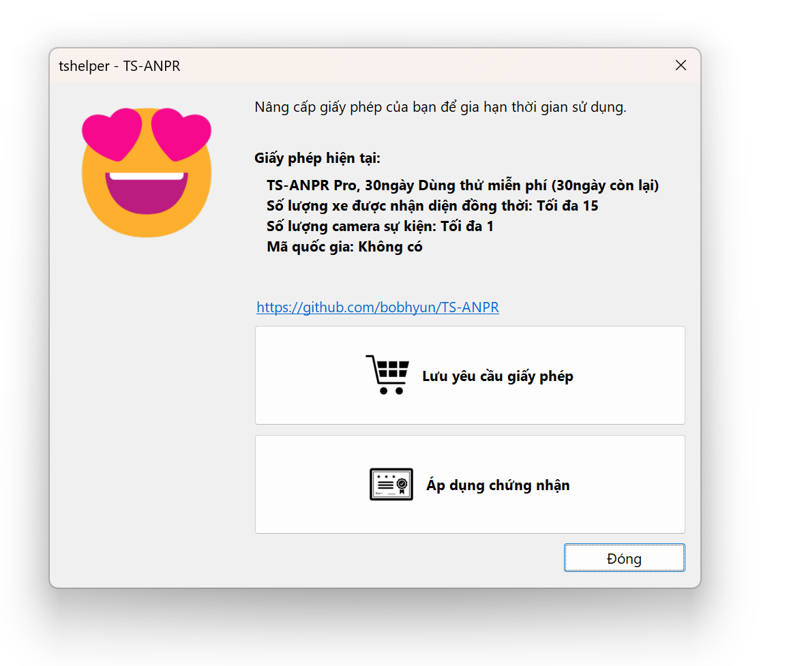
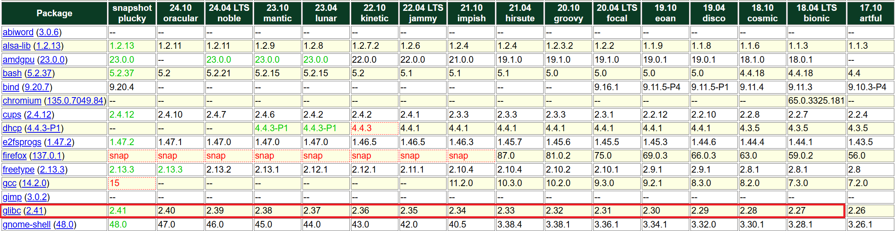

[English](../../Usage.md) | [日本語](../ja-JP/Usage.md) | [한국어](../ko-KR/Usage.md) | Tiếng Việt

# Cài đặt động cơ và giấy phép

## Dành cho Windows

Giải nén các tệp động cơ ANPR vào thư mục cài đặt bạn muốn.

##### Windows x86 64-bit (windows-x86_64)

```
  /windows-x86_64         # Thư mục nhị phân 64bit cho Windows
    tsanpr.dll            # Thư viện chia sẻ (cung cấp API)
    tsanpr-xx-xxxxx.eon   # Mô hình deep learning
    tshelper.exe          # Ứng dụng hỗ trợ (quản lý giấy phép)
```

##### Windows x86 32-bit (windows-x86)

```
  /windows-x86            # Thư mục nhị phân 32bit cho Windows
    tsanpr.dll            # Thư viện chia sẻ (cung cấp API)
    tsanpr-xx-xxxxx.eon   # Mô hình deep learning
    tshelper.exe          # Ứng dụng hỗ trợ (quản lý giấy phép)
```

Chạy tệp `tshelper.exe` để tự động cài đặt **giấy phép dùng thử 30 ngày** trên máy tính này. Sau đó, bạn có thể sử dụng tất cả tính năng của **TS-ANPR Pro** trong 30 ngày.


## Dành cho Linux

### 1. Cài đặt

#### 1.1 Giải nén tệp

Giải nén các tệp động cơ ANPR vào thư mục cài đặt bạn muốn.

##### Linux x86 64-bit (linux-x86_64)

```sh
tar -xvf tsanpr-*-linux-x86_64.tar.gz
```

Danh sách tệp sau khi giải nén:

```
  /linux-x86_64           # Thư mục nhị phân 64bit cho Linux x86
    libtsanpr.so          # Thư viện chia sẻ (cung cấp API)
    tsanpr-xx-xxxxx.eon   # Mô hình deep learning
    tshelper              # Ứng dụng hỗ trợ (quản lý giấy phép)
```

##### Linux ARM 64-bit (linux-aarch64)

```sh
tar -xvf tsanpr-*-linux-aarch64.tar.gz
```

Danh sách tệp sau khi giải nén:

```
  /linux-aarch64          # Thư mục nhị phân 64bit cho Linux ARM
    libtsanpr.so          # Thư viện chia sẻ (cung cấp API)
    tsanpr-xx-xxxxx.eon   # Mô hình deep learning
    tshelper              # Ứng dụng hỗ trợ (quản lý giấy phép)
```

#### 1.2. Cài đặt giấy phép

Quản lý giấy phép bằng chương trình `tshelper`.
Khi chạy lần đầu trên hệ thống, giấy phép hiện tại sẽ hiển thị là `Chưa cài đặt`.

```sh
./tshelper

TS-ANPR v2.6.0 (linux-x86_64)
(C) 2022-2025. TS Solution Corp. all rights reserved.

https://github.com/bobhyun/TS-ANPR

Giấy phép hiện tại:
Chưa cài đặt

Cách sử dụng:
  --lang, -l [LANG_ID]            # Chọn ngôn ngữ hiển thị [en, ja, ko, vi]
  --trial, -t                     # Cài đặt giấy phép dùng thử
  --req, -r                       # Tạo tệp yêu cầu giấy phép
  --cert, -c [CERT_FILENAME]      # Cài đặt tệp chứng chỉ giấy phép
  --dongle, -d                    # Cấu hình môi trường USB dongle giấy phép

Ví dụ sử dụng:
  ./tshelper -l vn                # Hiển thị tiếng Việt
  sudo ./tshelper -t              # Cài đặt giấy phép dùng thử (cần quyền root)
  sudo ./tshelper -r              # Tạo tệp yêu cầu giấy phép (cần quyền root)
  sudo ./tshelper -c sample.cert  # Cài đặt tệp chứng chỉ giấy phép (cần quyền root)
  sudo ./tshelper -d              # Cấu hình môi trường USB dongle giấy phép (cần quyền root)
```

_**Lưu ý**: Ngôn ngữ hiển thị tuân theo cài đặt mặc định của thiết bị đầu cuối. Nếu bạn muốn hiển thị bằng tiếng Việt, bạn có thể làm như sau._

```sh
./tshelper -l vn
```

##### 1.2.1 Cài đặt giấy phép dùng thử

```sh
sudo ./tshelper -t

TS-ANPR v2.6.0 (linux-x86_64)
(C) 2022-2025. TS Solution Corp. all rights reserved.

https://github.com/bobhyun/TS-ANPR

Đã cài đặt giấy phép mới.

Giấy phép hiện tại:
  TS-ANPR Pro, giấy phép dùng thử 30 ngày (còn 30 ngày)
  Số lượng xe có thể nhận dạng đồng thời: Tối đa 15
```

##### 1.2.2 Giấy phép chính thức (giấy phép phần mềm)

Giấy phép phần mềm được quản lý bằng cách xác định ID duy nhất của từng hệ thống và cài đặt giấy phép được cấp chỉ hoạt động trên hệ thống đó.

###### (1) Tạo yêu cầu giấy phép

Nếu bạn gửi tệp yêu cầu giấy phép được tạo bằng lệnh bên dưới, chúng tôi sẽ cấp tệp chứng chỉ cho hệ thống đó.

```sh
sudo ./tshelper -r

TS-ANPR v2.6.0 (linux-x86_64)
(C) 2022-2025. TS Solution Corp. all rights reserved.

https://github.com/bobhyun/TS-ANPR

Giấy phép hiện tại:
  TS-ANPR Pro, giấy phép dùng thử 30 ngày (còn 30 ngày)
  Số lượng xe có thể nhận dạng đồng thời: Tối đa 15

Tệp yêu cầu giấy phép đã được lưu.

Tên tệp: O20250414-TS-ANPR-8f5b0de4e9eabab6d727ab5c0d4c97e3.req
```

###### (2) Cài đặt chứng chỉ

Cài đặt tệp chứng chỉ chính thức đã nhận được bằng lệnh bên dưới.

```sh
sudo ./tshelper -c C20250414-TS-ANPR-8f5b0de4e9eabab6d727ab5c0d4c97e3.cert

TS-ANPR v2.6.0 (linux-x86_64)
(C) 2022-2025. TS Solution Corp. all rights reserved.

https://github.com/bobhyun/TS-ANPR

Đã cài đặt giấy phép mới.
Giấy phép hiện tại:
  TS-ANPR Pro, giấy phép chính thức
  Số lượng xe có thể nhận dạng đồng thời: Tối đa 15
```

##### 1.2.3 Giấy phép chính thức (USB dongle)

Giấy phép USB dongle sẽ được áp dụng ngay khi cắm thiết bị vào hệ thống.  
**Riêng với Linux**: Cần chạy lệnh sau trước khi cắm USB dongle lần đầu tiên.

```sh
sudo ./tshelper -d
TS-ANPR v2.6.0 (linux-x86_64)
(C) 2022-2025. TS Solution Corp. all rights reserved.

https://github.com/bobhyun/TS-ANPR

Đã thiết lập môi trường nhận diện USB dongle giấy phép.
Từ giờ USB dongle sẽ được tự động nhận diện khi cắm vào.
Nếu USB dongle đã được cắm sẵn, hãy rút ra và cắm lại.
```

### 2. Hệ điều hành Linux được hỗ trợ

Tương thích với mọi bản phân phối Linux có `glibc 2.27` trở lên.  
Kiểm tra phiên bản `glibc` bằng lệnh:

```sh
ldd --version

ldd (Ubuntu GLIBC 2.35-0ubuntu3.1) 2.35
Copyright (C) 2022 Free Software Foundation, Inc.
This is free software; see the source for copying conditions.  There is NO
warranty; not even for MERCHANTABILITY or FITNESS FOR A PARTICULAR PURPOSE.
Written by Roland McGrath and Ulrich Drepper.
```

**Danh sách bản phân phối tương thích chính**:

- Ubuntu 18.04 trở lên
- Debian 10 trở lên
- CentOS/RHEL/Oracle Linux 8 trở lên
- Fedora 28 trở lên

_**Lưu ý**: Xem khả năng tương thích với các bản phân phối khác tại distrowatch.com.  
Ví dụ với Ubuntu: Tìm mục `glibc` trong danh sách package (khoảng giữa trang) để kiểm tra phiên bản 2.27+._
https://distrowatch.com/table.php?distribution=ubuntu

